# DSA3050-PowerBI-Snit-Teshome-670552

## DSA3050A Business Intelligence & Data Visualization
### Power BI Retail Sales Analytics Project

---

# 1. Dataset Selection & Understanding

## 1.1 Dataset Source

The dataset used for this Power BI project is the **Online Retail II** dataset from the **UCI Machine Learning Repository**.

**Source:** UCI Machine Learning Repository  
**Dataset:** Online Retail II  
**Original dataset:** Approximately 1.07 million transaction records  
**Original period:** December 2009 – December 2011

The original dataset is available from:

https://archive.ics.uci.edu/dataset/502/online%2Bretail%2Bii

The original dataset contains transaction-level records from a UK-based registered non-store online retailer. It provides information about invoices, products, quantities, transaction dates, prices, customers and countries.

---

## 1.2 Dataset Description

The Online Retail II dataset contains transaction-level information from an online retail business.

Each row represents an individual **product transaction line associated with an invoice**. Therefore, one invoice can contain multiple rows when a customer purchases multiple products.

The dataset contains information about:

- Transaction/invoice identification
- Product identification
- Product description
- Quantity purchased
- Transaction date and time
- Unit price
- Customer identification
- Customer country

This structure makes the dataset appropriate for business intelligence analysis because sales performance can be analyzed across different dimensions such as **time, product, customer and country**.

---

## 1.3 Dataset Selection Rationale

The Online Retail II dataset was selected because it satisfies the main dataset requirements for the DSA3050A practical examination.

The original dataset contains more than one million records, which is considerably larger than necessary for the practical examination. Therefore, a continuous **six-month analytical window** was selected from the original dataset.

The selected working dataset contains:

**209,875 records and 8 variables.**

Using a six-month analytical scope makes the Power BI project more manageable while still retaining enough records and business complexity for meaningful analysis.

The selected period is:

**4 January 2010 – 29 June 2010**

The dataset was intentionally kept in its original transaction-level form rather than using a pre-cleaned or summarized version.

This allows the project to demonstrate actual data profiling, cleaning, transformation, modelling, DAX development and dashboard construction.

---

## 1.4 Dataset Size and Scope

### Original Dataset

The original Online Retail II dataset contains approximately:

**1,067,371 transaction records**

covering approximately two years of retail activity.

### Selected Analytical Dataset

For this project, a continuous six-month period was selected to create a manageable analytical scope.

| Attribute | Value |
|---|---:|
| Records | 209,875 |
| Variables | 8 |
| Start Date | 4 January 2010 |
| End Date | 29 June 2010 |
| Distinct Invoice Values | 12,349 |
| Distinct Stock Codes | 4,034 |
| Distinct Product Descriptions | 3,744 |
| Distinct Customer IDs | 2,815 |
| Countries | 32 |

The selected period provides sufficient scale and analytical diversity while avoiding unnecessary processing of the entire 1+ million-row source dataset.

---

## 1.5 Main Variables

The dataset contains the following eight original variables:

| Variable | Data Type | Description | Analytical Role |
|---|---|---|---|
| `Invoice` | Text / Identifier | Identifies the transaction/invoice | Transaction identifier |
| `StockCode` | Text / Identifier | Identifies the product | Product identifier |
| `Description` | Text / Categorical | Describes the product | Product attribute |
| `Quantity` | Numerical | Number of units involved in the transaction | Sales quantity |
| `InvoiceDate` | Date/Time | Date and time of the transaction | Time dimension |
| `Price` | Numerical | Unit price associated with the transaction | Revenue calculation |
| `CustomerID` | Identifier | Identifies the customer | Customer dimension |
| `Country` | Categorical | Country associated with the customer | Geographic dimension |

### Numerical Variables

The main numerical variables are:

- `Quantity`
- `Price`

These variables can be used to calculate sales-related KPIs.

For example:

**Sales Amount = Quantity × Price**

### Categorical Variables

The main categorical variables include:

- `Description`
- `Country`

`StockCode` and `Invoice` are primarily identifiers rather than descriptive categorical variables.

### Date/Time Variable

`InvoiceDate` provides transaction date and time information and allows the analysis of:

- Daily sales
- Monthly sales
- Sales trends
- Month-over-month performance

### Identifier Variables

The main identifiers are:

- `Invoice`
- `StockCode`
- `CustomerID`

These identifiers will later support the data model and relationships between fact and dimension tables.

---

## 1.6 Initial Dataset Quality Assessment

Before applying any transformations, the dataset was profiled in Power Query using:

- Column Quality
- Column Distribution
- Column Profile

Column profiling was performed using the **entire dataset** rather than only the default preview rows.

### Initial findings

The raw dataset contains realistic data-quality issues that require investigation before modelling.

#### Missing CustomerID

Approximately **20% of CustomerID values are empty**.

This does not automatically mean that the corresponding sales transactions are invalid. Therefore, these records will not be removed without further investigation.

The impact of missing CustomerID will be considered when performing customer-level analysis.

#### Missing Description

The `Description` column contains a small number of missing values, representing **less than 1%** of the records.

These records will be investigated during Power Query rather than being automatically deleted.

#### Negative Quantity

Negative quantity values are present.

Negative quantities may represent cancellations, returns or reversed transactions. Therefore, they require investigation before any decision is made to remove them.

#### Cancellation Transactions

Some invoice values begin with `C`, for example:

`C493411`

This indicates a potential cancellation pattern that will be investigated during Power Query.

Rather than automatically deleting these records, the project will determine whether a cancellation indicator should be created.

#### Zero Price Values

The profiling identified:

**2,051 records with Price = 0.**

These records require investigation to determine whether they represent legitimate business cases, special transactions or invalid records.

#### Negative Price Values

The `Price` profile contains negative values and therefore requires further investigation.

The minimum observed value is unusually negative, so the affected records will be examined before deciding whether any transformation is necessary.

#### Test Product Record

The raw dataset contains a record with:

`StockCode = TEST001`

and:

`Description = This is a test product.`

This will be investigated during Power Query to determine whether it represents a genuine business record or a test transaction.

### Initial Quality Assessment

Based on the initial profiling, the dataset is considered to contain **manageable, realistic data-quality issues rather than severe corruption**.

The project will therefore follow a **light and evidence-based cleaning approach**.

No transformation will be performed simply to increase the number of transformations required by the assignment.

Each Power Query transformation will be based on an actual problem identified in the dataset.

---

## 1.7 Data Profiling Evidence

The following screenshots document the initial dataset inspection.

### Dataset Loading

The original six-month dataset was loaded into Power BI.

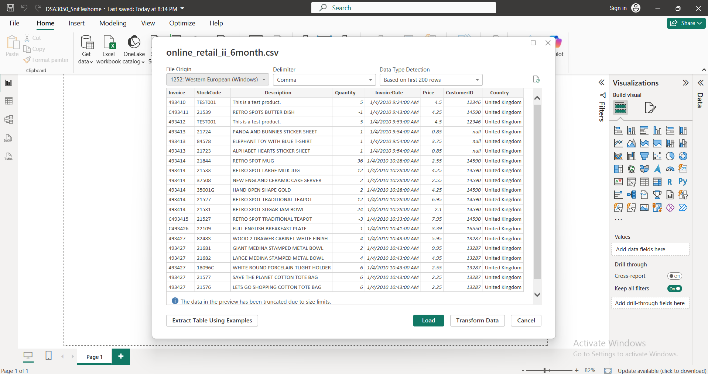

### Raw Power Query State

The dataset was opened in Power Query before any transformations were applied.

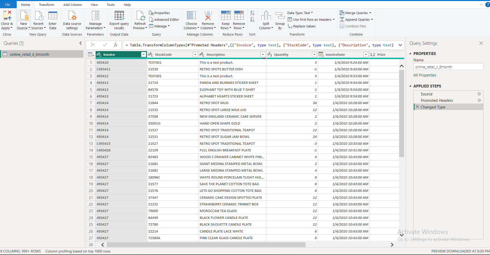

### Data Quality Baseline

Column Quality, Column Distribution and Column Profile were enabled to assess the dataset before cleaning.

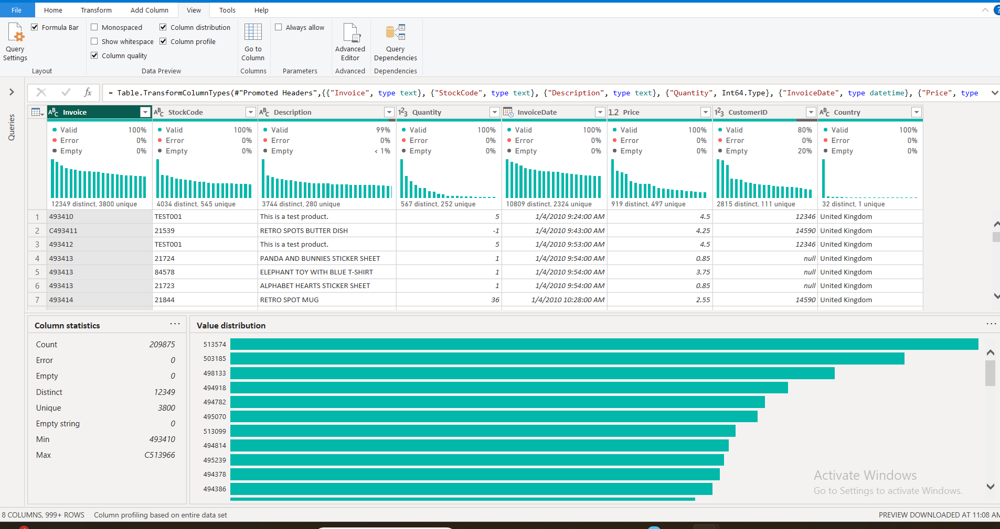

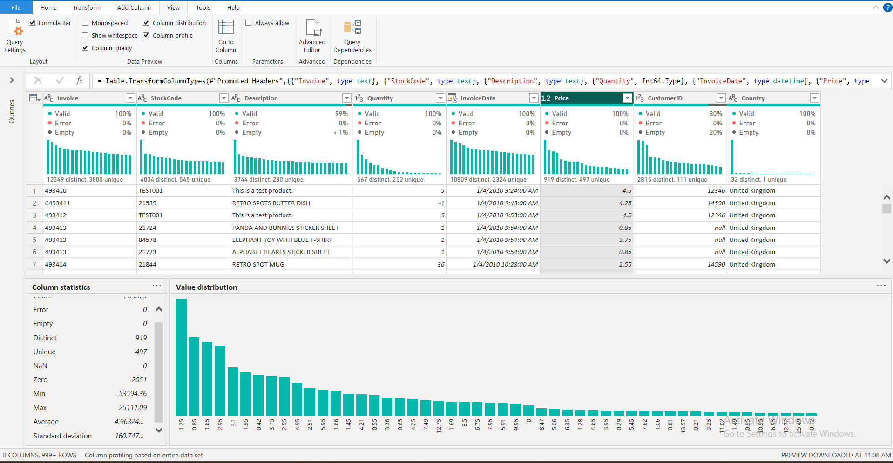

### Date Range Verification

The `InvoiceDate` column was profiled to verify the analytical period.

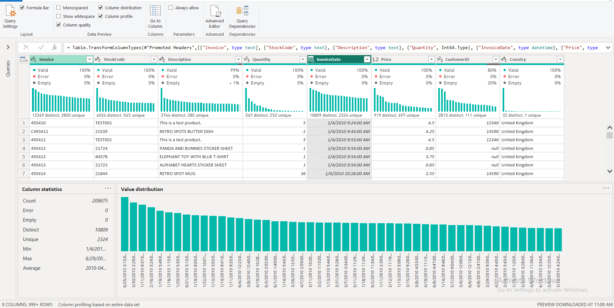

These screenshots provide evidence of the dataset state before Power Query transformations.

---

## 1.8 Potential KPIs

The dataset supports several meaningful retail KPIs.

### Total Revenue

Revenue can be calculated using:

**Revenue = Quantity × Price**

### Other potential KPIs

- Total Revenue
- Total Quantity Sold
- Total Orders
- Total Customers
- Average Order Value
- Average Unit Price
- Revenue per Customer
- Revenue per Product
- Cancellation Rate
- Average Items per Order
- Monthly Revenue Growth
- Revenue Contribution by Product
- Revenue Contribution by Country

These KPIs will be implemented using DAX after the Power Query and data modelling stages are completed.

---

## 1.9 Business / Analytical Problem

The main business problem is to understand **retail sales performance across time, products, customers and countries**.

The Power BI solution will investigate the major drivers of sales performance and identify areas that require management attention.

The analysis will focus on questions such as:

- Which products generate the most revenue?
- Which customers contribute most to revenue?
- Which countries generate the highest sales?
- How does revenue change over time?
- Which products have high or low sales volumes?
- How does average order value change?
- Are cancellations or unusual transactions affecting reported performance?

The final dashboard will convert the transaction-level data into an interactive business intelligence solution that supports decision-making.

---

## 1.10 Analytical Questions

The Power BI solution will answer the following analytical questions:

### Question 1
**How does revenue change over the six-month period?**

This will identify sales trends and changes in monthly performance.

### Question 2
**Which products generate the highest revenue?**

This will identify the major product-level revenue drivers.

### Question 3
**Which products have the highest sales volume?**

This will distinguish products that sell large quantities from products that generate high revenue because of higher prices.

### Question 4
**Which countries contribute the most revenue?**

This will provide a geographic view of business performance.

### Question 5
**Which customers generate the highest revenue?**

This will identify high-value customers and customer concentration.

### Question 6
**How does average order value change over time?**

This will help determine whether customers are spending more or less per order.

### Question 7
**What transaction patterns or unusual records require attention?**

This will investigate cancellations, negative quantities, zero prices, missing customer information and other data-quality patterns identified during profiling.
# 2. Section B — Power Query: Data Cleaning & Transformation

**Marks: 20**

## 2.1 Section B Requirement

The assignment requires Power Query to be used extensively to transform the raw dataset into a form suitable for analysis.

The examination specifically states that:

> "Simply importing a clean CSV/Excel file and clicking Close & Apply will receive very limited marks."

Therefore, the Power Query process was based on the actual data-quality problems identified during the initial profiling in Section A.

The cleaning approach was **evidence-based**. Transformations were not performed simply to increase the number of steps. Each significant transformation was justified using the structure:

**Problem → Transformation → Reason → Result**

The Power Query workflow includes more than the required **8 significant transformations**.

---

# 2.2 Power Query Cleaning Strategy

The main data-quality issues identified during the initial profiling were:

1. Incorrect/uncertain data types
2. An identified test record (`TEST001`)
3. Missing and inconsistently formatted `CustomerID` values
4. Negative quantities
5. Cancellation transactions
6. Non-cancellation negative quantities
7. Zero-price transactions
8. Negative-price transactions
9. Duplicate records
10. The need for final data-quality validation

The transformations were applied sequentially so that each cleaning step builds on the result of the previous step.

The overall workflow was:

**Raw Data**
↓
**Correct Data Types**
↓
**Remove TEST001**
↓
**Clean CustomerID**
↓
**Investigate Negative Quantity**
↓
**Identify Cancellation Invoices**
↓
**Remove Non-Cancellation Negative Quantities**
↓
**Investigate/Handle Zero Prices**
↓
**Investigate/Handle Negative Prices**
↓
**Remove Duplicates**
↓
**Final Data Validation**
↓
**Clean Analytical Dataset**

---

# 2.3 Transformation 1 — Correct Data Types

### Problem

The raw CSV contains fields representing identifiers, text, numerical values and date/time information. These fields must have appropriate data types before filtering, calculations and modelling.

### Transformation

Power Query was used to explicitly assign appropriate data types:

- `Invoice` → Text
- `StockCode` → Text
- `Description` → Text
- `Quantity` → Whole Number
- `InvoiceDate` → Date/Time
- `Price` → Decimal Number
- `CustomerID` → Text
- `Country` → Text

### Reason

Correct data types ensure that Power Query performs filtering, comparisons, calculations and later DAX operations correctly.

For example, `InvoiceDate` must be recognized as a date/time field for time-based analysis, while `Quantity` must be numeric for sales calculations.

### Result

All eight variables were assigned appropriate analytical data types.

### 📸 Screenshot Evidence

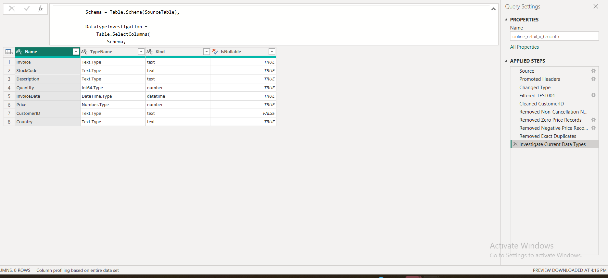

---

# 2.4 Transformation 2 — Remove TEST001

### Problem

During the initial data profiling, a record with:

`StockCode = TEST001`

was identified.

The corresponding description indicated that it was a test product rather than a genuine retail product.

### Transformation

Power Query was used to filter out the record where:

`StockCode = TEST001`

### Reason

A test transaction does not represent a genuine business transaction. Keeping it could affect product counts, transaction counts and other analytical results.

### Result

The identified test record was removed while the remaining valid transactions were retained.

### 📸 Before Transformation

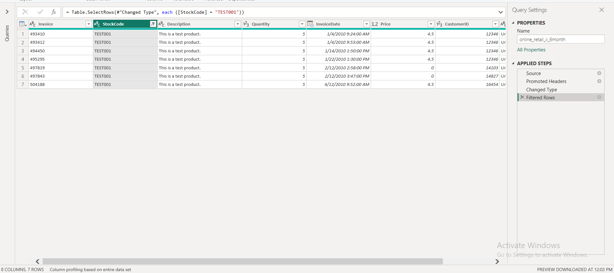

### 📸 After Transformation

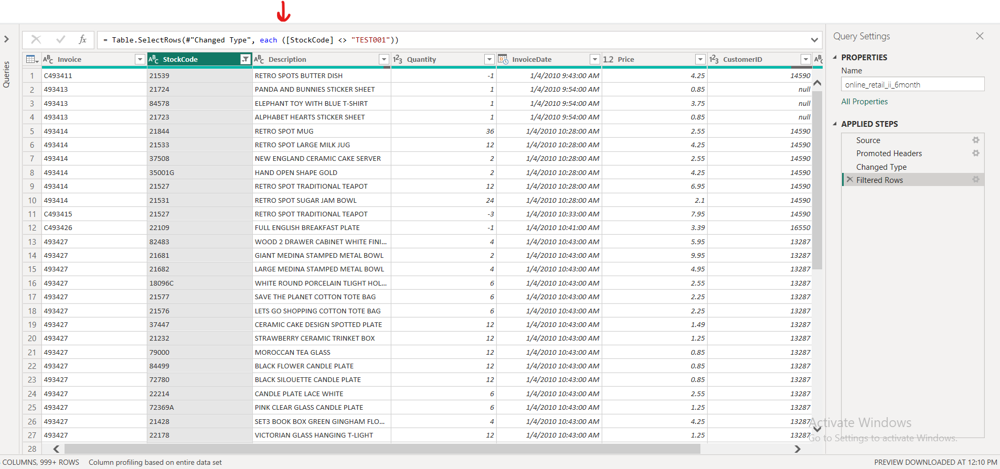

---

# 2.5 Transformation 3 — Clean and Standardize CustomerID

### Problem

The `CustomerID` field contained missing values and inconsistent identifier formatting.

Some customer identifiers were also represented with unnecessary decimal formatting such as `.0`.

### Transformation

The `CustomerID` field was transformed so that:

- Missing values were represented as `Unknown`
- Blank values were handled
- Leading/trailing spaces were removed
- Unnecessary `.0` formatting was removed

### Reason

Missing `CustomerID` values do not necessarily mean that the associated transaction is invalid.

Deleting these transactions would unnecessarily reduce the amount of valid sales information available for analysis.

Representing missing identifiers as `Unknown` allows the transaction to remain in the dataset while clearly indicating that the customer identity is unavailable.

### Result

The `CustomerID` field was standardized while valid transactions with missing customer information were retained.

### 📸 Investigation

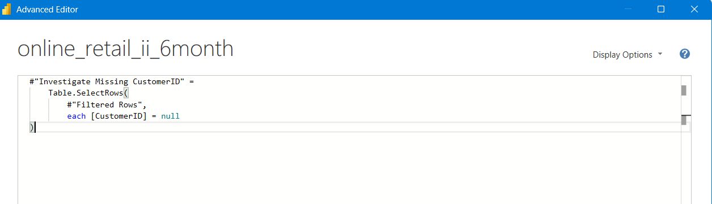

### 📸 Before Cleaning

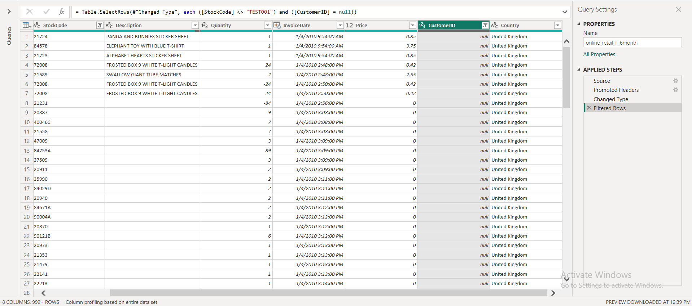

### 📸 Query Evidence

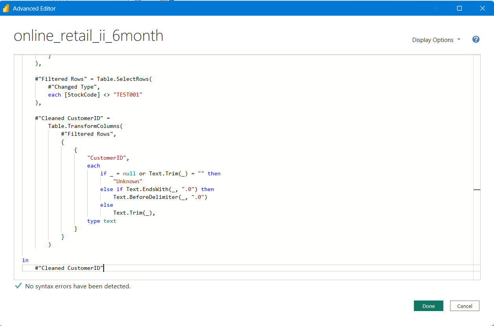

### 📸 After Cleaning

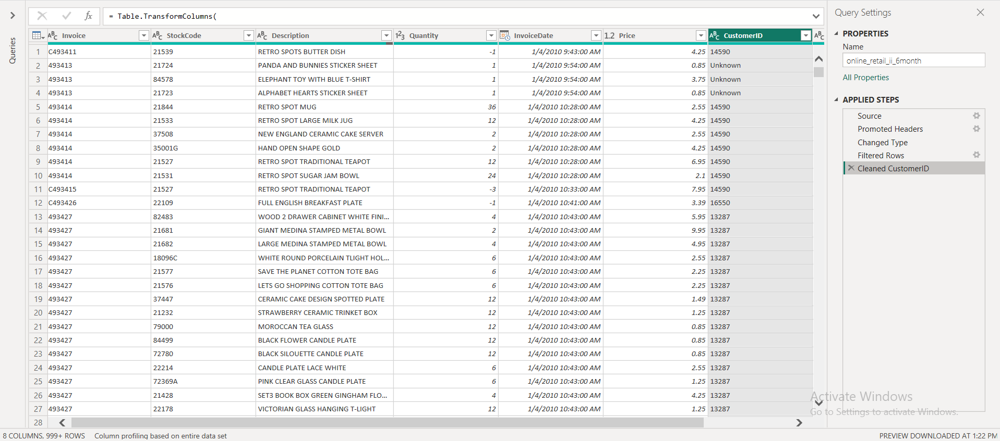

---

# 2.6 Transformation 4 — Investigate Negative Quantities

### Problem

The `Quantity` field contained negative values.

A negative quantity cannot automatically be assumed to be an error because retail datasets may contain returns or cancellation transactions.

### Transformation

All negative quantities were first isolated and investigated.

The invoice identifiers were then examined to determine whether the negative quantity was associated with a cancellation invoice.

### Reason

Automatically deleting every negative quantity could remove legitimate business events.

The analysis therefore distinguished between:

- Negative quantities associated with cancellation invoices
- Negative quantities that were not cancellation invoices

### Result

Negative quantities were classified before the cleaning decision was made.

### 📸 Investigation Evidence

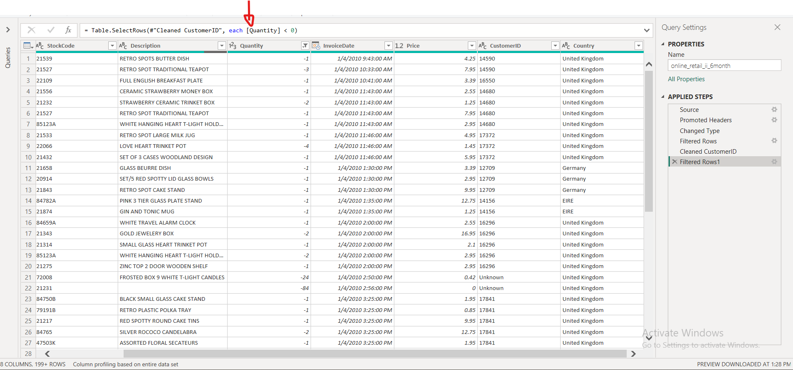

### 📸 Summary Evidence

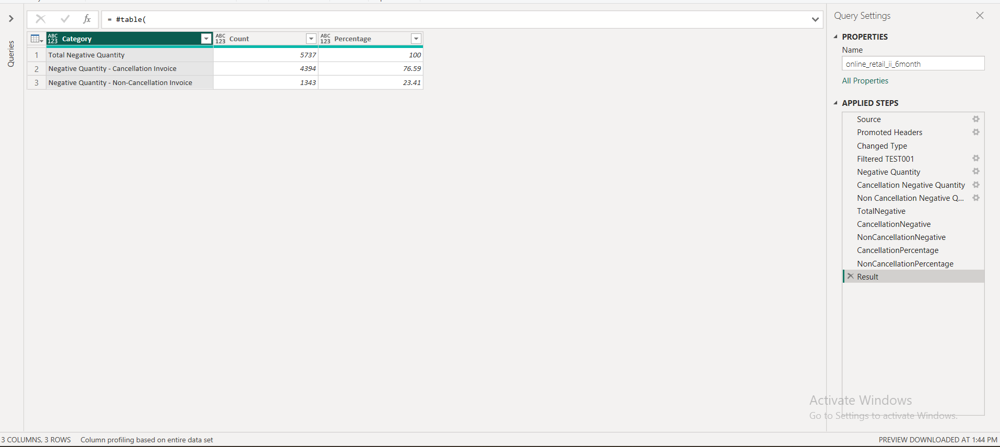

---

# 2.7 Transformation 5 — Identify and Validate Cancellation Invoices

### Problem

Some invoice identifiers begin with the letter `C`.

For example:

`C493411`

These records represent cancellation transactions and therefore require separate treatment.

### Transformation

Power Query was used to identify invoices beginning with `C`.

The cancellation records were then investigated based on:

- Quantity
- Price
- Invoice identifier

### Reason

Cancellation transactions are meaningful business events.

They should not automatically be deleted because the final analysis may need to measure cancellation activity.

### Result

Cancellation transactions were identified and retained as part of the analytical transaction history.

### 📸 Cancellation Investigation

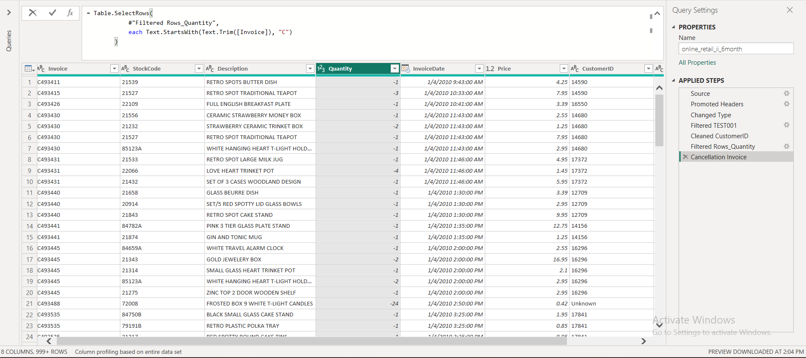

### 📸 Cancellation Summary

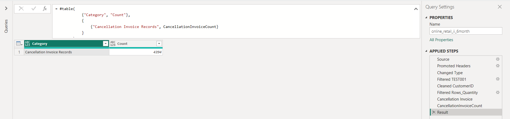

### 📸 Cancellation Validation

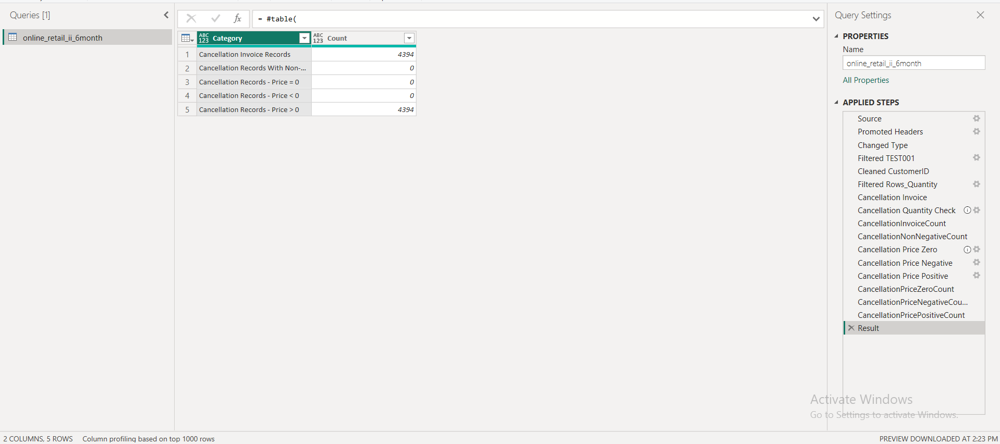

### 📸 Final Cancellation Results

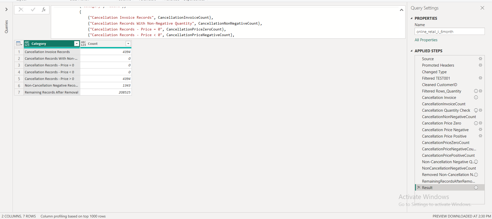

---

# 2.8 Transformation 6 — Remove Non-Cancellation Negative Quantities

### Problem

After investigating negative quantities, some negative-quantity records were found that were **not cancellation invoices**.

These records could distort quantity and revenue calculations.

### Transformation

The final transaction table was filtered to retain:

- Transactions with non-negative quantities
- Cancellation invoices

Negative quantities that were not associated with cancellation invoices were removed.

### Reason

This approach preserves legitimate cancellation activity while preventing unexplained negative quantities from distorting the analytical dataset.

### Result

Non-cancellation negative quantities were removed, while cancellation transactions were retained.

### 📸 Evidence


---

# 2.9 Transformation 7 — Investigate and Handle Zero-Price Transactions

### Problem

The initial profiling identified:

**2,051 records with `Price = 0`.**

A zero price may represent a legitimate business situation or an invalid transaction, so these records required investigation before removal.

### Transformation

Zero-price transactions were isolated and investigated separately from cancellation transactions.

The records determined to be invalid were removed from the final analytical transaction table.

### Reason

Revenue is calculated using:

**Revenue = Quantity × Price**

Therefore, invalid zero-price transactions could affect revenue and product-performance analysis.

The records were investigated before removal rather than being deleted automatically.

### Result

The invalid zero-price records identified during the investigation were removed from the analytical dataset.

### 📸 Investigation Evidence

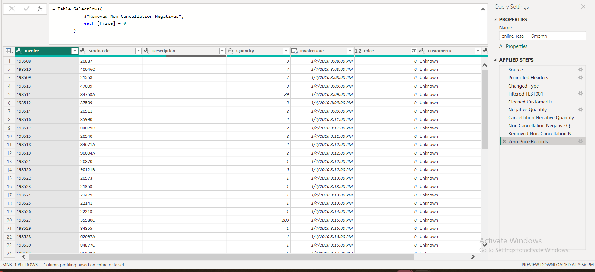

### 📸 Cleaning Evidence

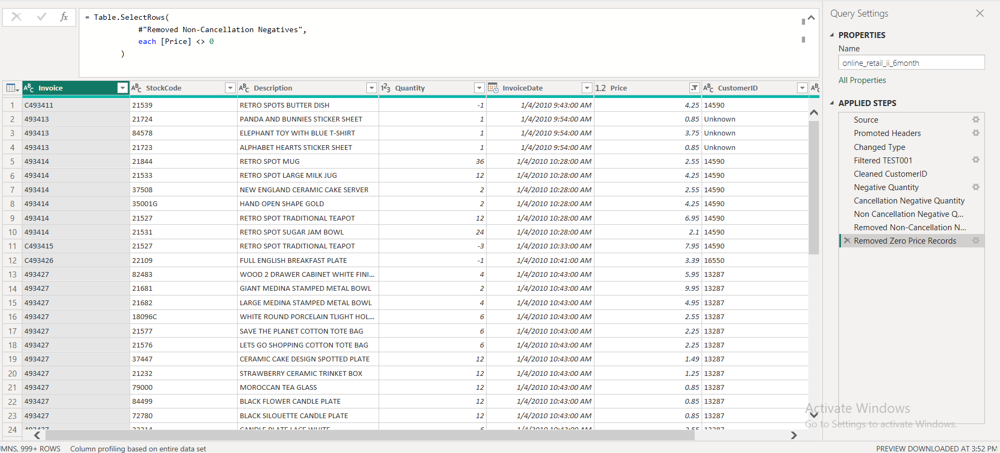

---

# 2.10 Transformation 8 — Investigate and Handle Negative Prices

### Problem

The `Price` field contained negative values.

Negative unit prices are not appropriate for ordinary sales revenue calculations and therefore required investigation.

### Transformation

Negative-price records were isolated and examined before the invalid records were removed.

### Reason

The `Price` field contributes directly to revenue calculations.

Retaining invalid negative prices could produce misleading revenue and product-performance results.

### Result

The identified invalid negative-price records were removed from the cleaned analytical dataset.

### 📸 Investigation Evidence

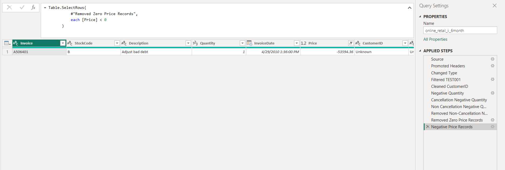

### 📸 Cleaning Evidence

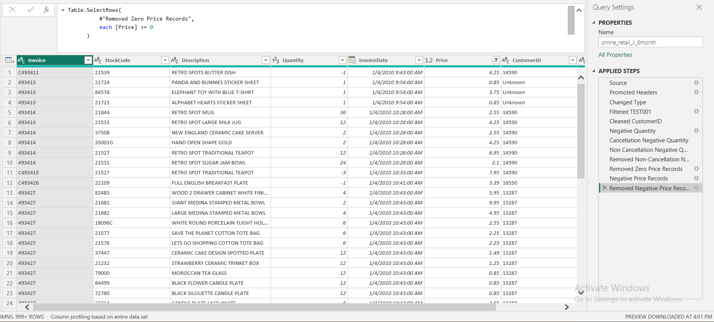

---

# 2.11 Transformation 9 — Remove Duplicate Records

### Problem

Duplicate transaction records can cause the same transaction line to be counted more than once.

This can artificially increase:

- Revenue
- Quantity
- Transaction counts
- Product performance
- Customer performance

### Transformation

Duplicate records were investigated in Power Query and confirmed duplicate records were removed.

### Reason

Each valid transaction line should contribute only once to the analytical dataset.

Removing confirmed duplicates prevents double counting while preserving distinct legitimate transactions.

### Result

Confirmed duplicate records were removed.

### 📸 Duplicate Investigation

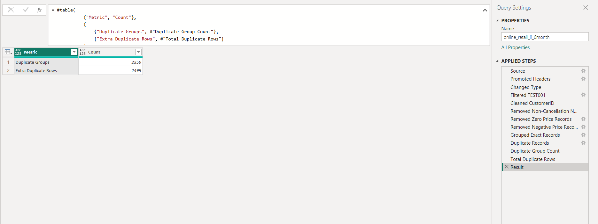

### 📸 Duplicates Removed

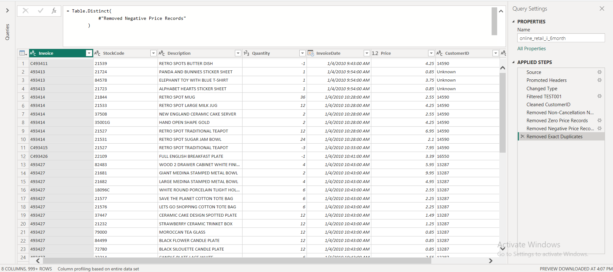

---

# 2.12 Final Data Quality Validation

After completing the significant Power Query transformations, the cleaned transaction table was subjected to a final validation.

The purpose of this step was to verify that:

- The identified test record was removed
- CustomerID was handled consistently
- Non-cancellation negative quantities were removed
- Valid cancellation transactions were retained
- Invalid price records were handled
- Duplicate records were removed
- Data types remained appropriate
- The final dataset was suitable for modelling and analysis

### Result

The final transaction table represents the cleaned analytical dataset that will be used for the subsequent **Data Modelling** stage.

### 📸 Final Power Query Validation

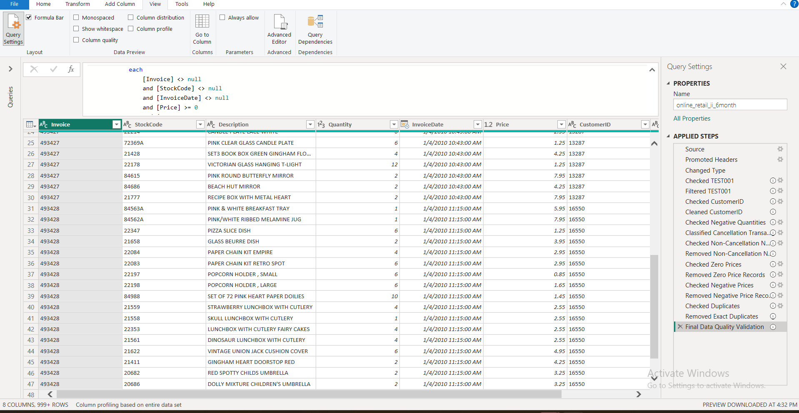

---

# 2.13 Complete Power Query Applied Steps

The individual screenshots above provide evidence for the important transformation decisions.

The final screenshot below provides evidence of the **complete Power Query workflow**, showing that the transformations were actually applied sequentially rather than simply describing them in the README.

### 📸 Complete Applied Steps


---

# 2.14 Section B — Transformation Summary

The following table demonstrates that the Power Query work satisfies the examination requirement of documenting significant transformations using:

**Problem → Transformation → Reason → Result**

| # | Problem | Transformation | Reason | Result |
|---|---|---|---|---|
| 1 | Fields required appropriate analytical types | Corrected data types | Ensure reliable filtering, calculations and modelling | Consistent data types |
| 2 | `TEST001` identified as a test record | Removed `TEST001` | Prevent test data from affecting analysis | Test record removed |
| 3 | Missing/inconsistent CustomerID values | Cleaned and standardized CustomerID | Preserve valid transactions while standardizing identifiers | CustomerID standardized |
| 4 | Negative quantities identified | Investigated negative quantities | Distinguish cancellations from invalid negatives | Negative quantities classified |
| 5 | Cancellation invoices identified | Isolated and validated `C...` invoices | Preserve meaningful cancellation activity | Cancellation records retained |
| 6 | Non-cancellation negative quantities identified | Removed non-cancellation negatives | Prevent invalid quantities from distorting analysis | Invalid negative quantities removed |
| 7 | Zero-price records identified | Investigated and handled invalid zero-price records | Protect revenue calculations | Invalid zero-price records removed |
| 8 | Negative prices identified | Investigated and removed invalid negative prices | Prevent distorted revenue calculations | Invalid negative-price records removed |
| 9 | Duplicate records identified | Removed confirmed duplicates | Prevent double counting | Duplicate records removed |
| 10 | Final cleaned dataset required | Performed final validation | Confirm cleaning decisions and dataset integrity | Dataset ready for modelling |

---

# 2.15 Section B Marking Criteria Coverage

The Power Query work addresses the examination requirements as follows:

### ✔ Extensive Power Query Use

The raw transaction dataset was transformed through multiple sequential Power Query steps rather than simply importing the CSV and loading it directly.

### ✔ Transformations Based on Actual Problems

Each major transformation was based on an issue identified during the initial dataset profiling in Section A.

### ✔ At Least 8 Significant Transformations

More than eight significant transformations have been documented.

### ✔ Problem → Transformation → Reason → Result

Every significant transformation is explicitly documented using the required structure.

### ✔ Screenshot Evidence

Screenshots are included immediately after the relevant transformation to demonstrate the actual Power Query work.

### ✔ Final Applied Steps Evidence

The final Power Query screenshot demonstrates the complete sequence of transformations applied to the dataset.

### ✔ Evidence-Based Cleaning

The project avoids aggressive deletion of records. Potentially meaningful business events, particularly cancellations, were investigated before cleaning decisions were made.

---

# 2.16 Section B Completion Status

**Section B — Power Query Data Cleaning & Transformation: COMPLETED**

The cleaned transaction dataset is now ready to proceed to:
# 3. Section C — Data Modelling

**Marks: 20**

## 3.1 Section C Requirement

The assignment requires the cleaned dataset to be transformed into an appropriate analytical data model.

The model should not simply consist of one large flat table unless there is a convincing technical justification. Since the Online Retail II dataset contains transactional information together with customer, product, location and date attributes, a **Star Schema** was selected as the most appropriate modelling approach.

The final model consists of:

**DimDate**  
↓  
**DimCustomer → FactSales ← DimProduct**  
↓  
**DimLocation**

The dimensions provide descriptive information, while the fact table contains the transaction-level business measures.

---

## 3.2 Data Modelling Strategy

The cleaned Power Query output was used as the starting point for the modelling stage.

The modelling process followed these steps:

1. Load the cleaned transaction dataset.
2. Identify the main transaction table.
3. Rename the main transaction table to `FactSales`.
4. Create a `DimCustomer` dimension.
5. Create a `DimProduct` dimension.
6. Create a `DimDate` dimension.
7. Create a `DimLocation` dimension.
8. Establish appropriate primary/foreign key fields.
9. Assign appropriate data types.
10. Establish one-to-many relationships.
11. Configure single-direction filtering from dimensions to the fact table.
12. Validate the completed Star Schema.
13. Recreate `DimProduct` following an issue identified during data type validation.

The objective was to create a model that supports efficient filtering, aggregation and DAX calculations without unnecessary many-to-many relationships or ambiguous filter paths.

---

# 3.3 Main Fact Table — FactSales

### Requirement

The model must identify the main fact table.

### Problem

The cleaned dataset contains individual transaction-line records. These records contain the quantitative information required for sales analysis, including:

- Quantity
- Price
- Invoice
- InvoiceDate
- StockCode
- CustomerID
- Country

### Transformation

The cleaned transaction table was renamed:

**`FactSales`**

### Reason

`FactSales` represents the business events being analysed. Each row corresponds to a transaction line associated with an invoice.

The table therefore forms the centre of the Star Schema.

It contains the transactional measures and foreign keys required to connect the transaction records to the descriptive dimensions.

### Result

The cleaned transaction data was established as the central fact table:

**FactSales**

### 📸 Screenshot Evidence

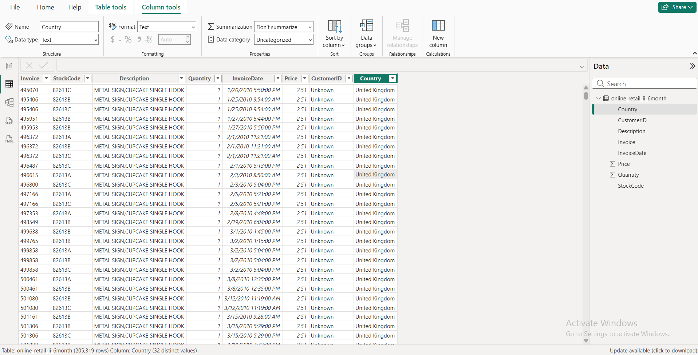

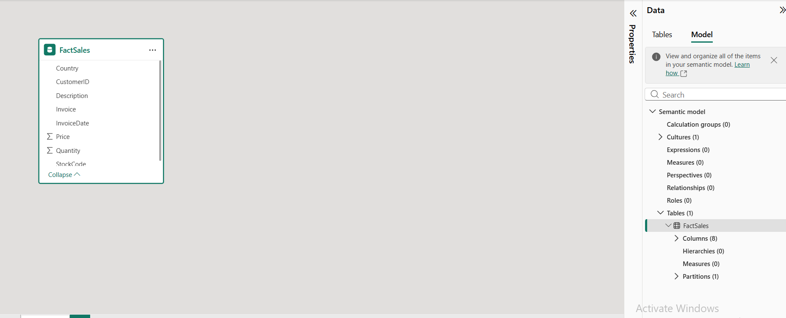

---

# 3.4 Customer Dimension — DimCustomer

### Requirement

The model should contain appropriate dimension tables where they are relevant to the dataset.

### Problem

Customer information is repeated across many transaction records in the fact table.

For example, the same `CustomerID` may appear on multiple invoices and transaction lines.

Keeping customer attributes directly in the fact table would create unnecessary repetition.

### Transformation

A separate customer dimension was created and named:

**`DimCustomer`**

The customer identifier was used as the key for the dimension.

### Reason

`DimCustomer` provides a dedicated location for customer-level descriptive information.

It allows customer analysis without unnecessarily repeating customer information throughout the transactional table.

It also supports analysis such as:

- Revenue by customer
- Customer ranking
- Customer transaction activity
- Customer-level filtering

### Result

A dedicated `DimCustomer` table was created with a suitable customer key.

### 📸 Screenshot Evidence

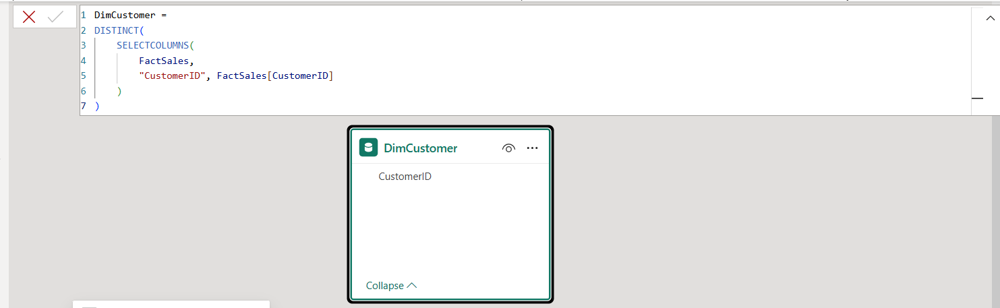

---

# 3.5 Product Dimension — DimProduct

### Requirement

The model should contain appropriate dimensions for important analytical entities.

### Problem

Product information is repeated across transaction lines.

The `StockCode` identifies products, while `Description` provides the product description.

### Transformation

A dedicated product dimension was created and named:

**`DimProduct`**

The product identifier was used as the key.

### Reason

Products represent an important analytical dimension for the retail dataset.

Separating product information from transaction information makes it possible to analyse:

- Revenue by product
- Quantity sold by product
- Product performance
- Product rankings

### Result

A dedicated `DimProduct` table was created and connected to `FactSales`.

### Revision Note — DimProduct Recreated

During the data type validation stage (Section 3.9), an issue was identified with the initial `DimProduct` dimension. The dimension was subsequently recreated to ensure `StockCode` held a properly distinct set of product keys, preserving the one-to-many relationship required against `FactSales`. The recreation was captured separately and is timestamped after the data type validation screenshots, confirming it was a corrective step rather than part of the original build sequence.

### 📸 Screenshot Evidence

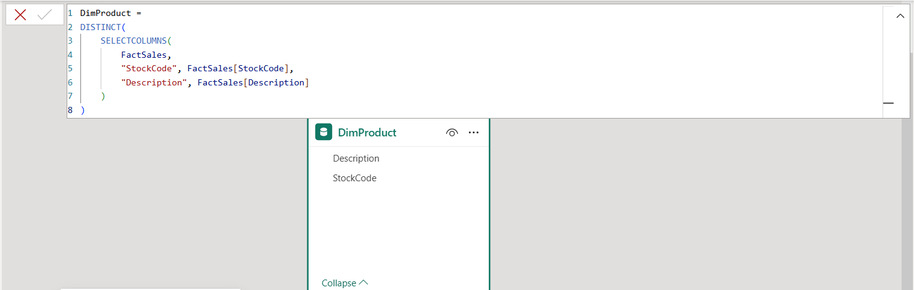

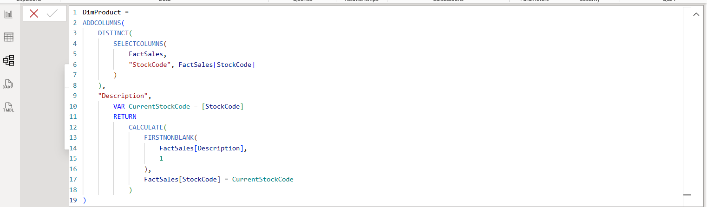

---

# 3.6 Date Dimension — DimDate

### Requirement

The assignment specifically requires a dedicated Date Table where the dataset supports time analysis.

### Problem

`InvoiceDate` contains transaction date and time information, but using the transaction date directly for all time-based analysis would not provide a complete analytical date dimension.

The project requires analysis of:

- Daily revenue
- Monthly revenue
- Revenue trends
- Time-based comparisons

### Transformation

A dedicated date dimension was created and named:

**`DimDate`**

The date dimension provides the date key required to connect dates with transaction records.

### Reason

A dedicated Date Table provides a consistent time dimension for Power BI analysis and DAX time-intelligence calculations.

It allows the model to organize transactions by meaningful calendar attributes rather than relying only on the raw transaction timestamp.

### Result

A dedicated `DimDate` table was created and used as the model's date dimension.

### 📸 Screenshot Evidence

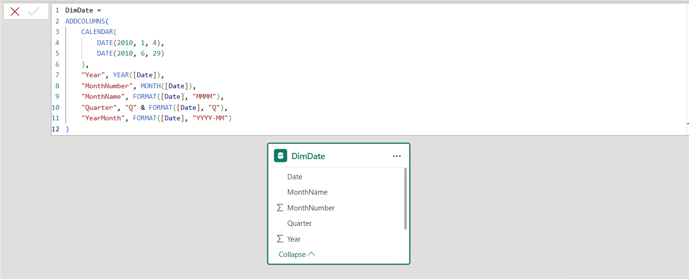

---

# 3.7 Location Dimension — DimLocation

### Requirement

Dimensions should be created where they provide meaningful analytical value.

### Problem

The `Country` field is repeated across many transaction records.

Country represents an important geographic dimension for the business analysis.

### Transformation

A dedicated location dimension was created and named:

**`DimLocation`**

The country/location identifier was used to connect geographic information to the transaction table.

### Reason

Separating location information into a dimension supports geographic analysis such as:

- Revenue by country
- Quantity by country
- Country-level performance
- Geographic filtering

### Result

A dedicated `DimLocation` table was created for geographic analysis.

### 📸 Screenshot Evidence

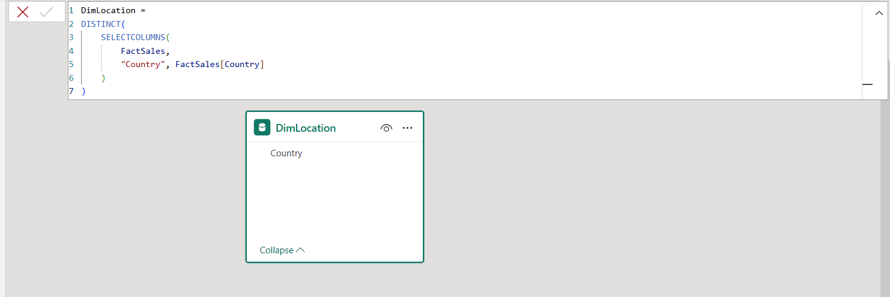

---

# 3.8 Primary and Foreign Keys

### Requirement

The model must contain primary/key fields suitable for relationships.

The following key structure was used:

| Dimension | Key | Fact Table Field |
|---|---|---|
| `DimCustomer` | `CustomerID` | `FactSales[CustomerID]` |
| `DimProduct` | `StockCode` | `FactSales[StockCode]` |
| `DimDate` | Date | `FactSales[InvoiceDate]` / Date field |
| `DimLocation` | Country/Location key | `FactSales[Country]` |

The dimension tables contain unique values for their respective keys.

The corresponding fields in `FactSales` act as foreign keys.

This structure allows the dimensions to filter the transaction table without introducing unnecessary many-to-many relationships.

---

# 3.9 Data Types

### Requirement

The model must use appropriate data types.

The major modelling fields were checked and assigned appropriate data types.

Examples include:

- `Invoice` → Text
- `StockCode` → Text
- `CustomerID` → Text
- `Description` → Text
- `Country` → Text
- `Quantity` → Whole Number
- `Price` → Decimal Number
- `InvoiceDate` → Date/Time
- Date keys → Date

### Reason

Correct data types are necessary for:

- Relationships
- Filtering
- Aggregation
- DAX calculations
- Date analysis

### Result

The modelling fields use data types appropriate to their analytical roles. It was during this validation pass that the `DimProduct` key issue described in Section 3.5 was identified.

### 📸 Screenshot Evidence

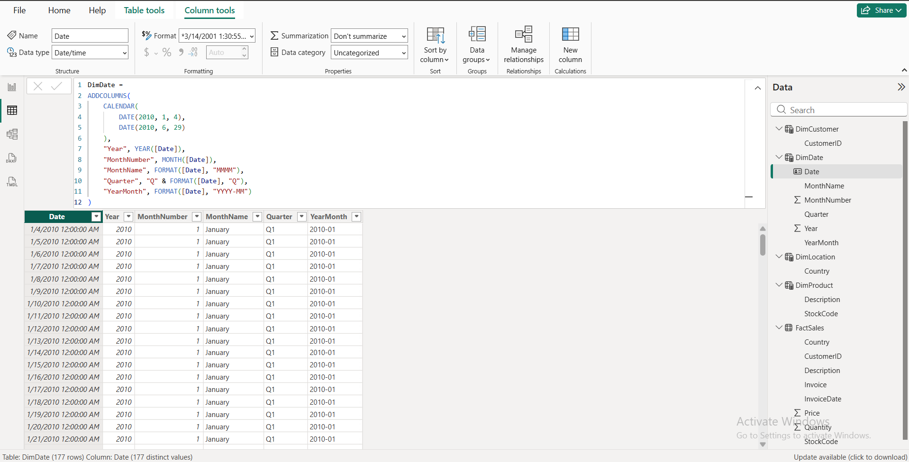

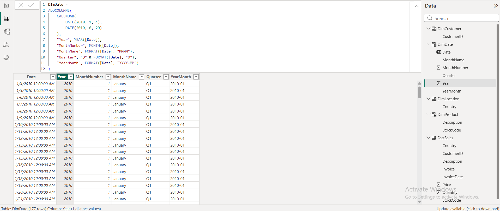

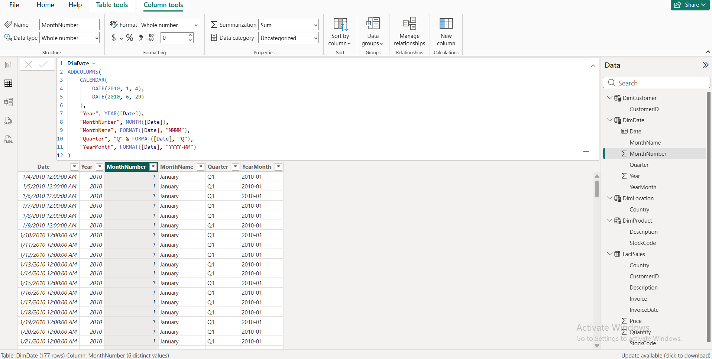

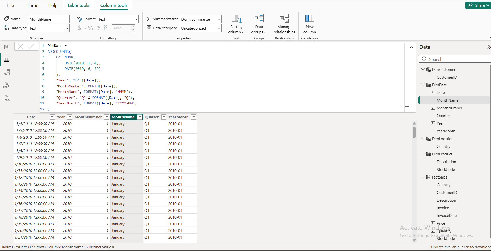

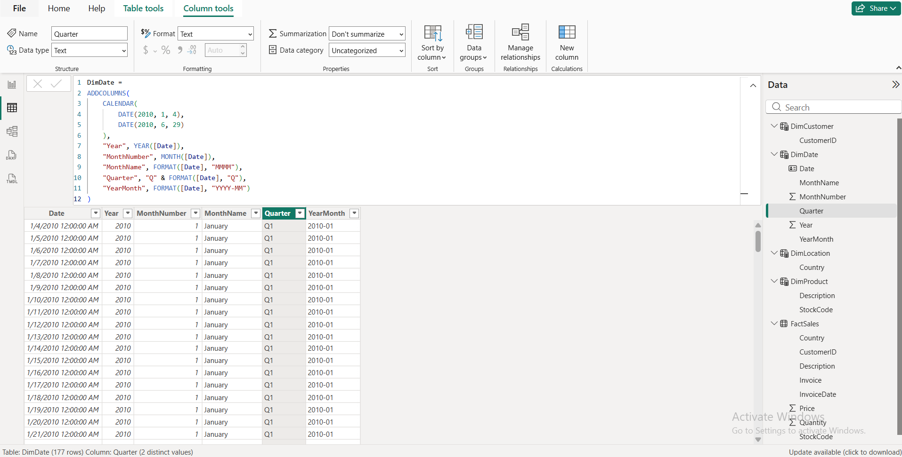

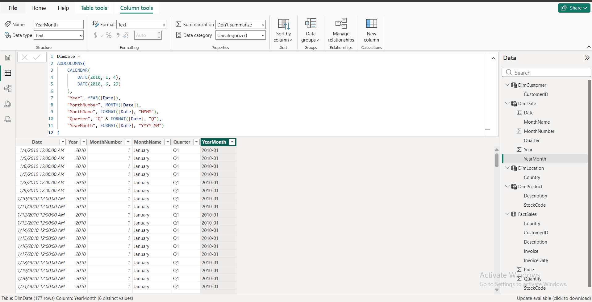

---

# 3.10 Table and Field Naming

### Requirement

The model must use clear table and field names.

The following naming convention was adopted:

- `FactSales`
- `DimCustomer`
- `DimProduct`
- `DimDate`
- `DimLocation`

The `Fact` prefix identifies the transactional table, while the `Dim` prefix identifies descriptive dimensions.

### Reason

This naming convention makes the model easier to understand and maintain.

It also makes the role of each table immediately clear when writing DAX measures and building reports.

---

# 3.11 Relationships

### Requirement

The assignment requires appropriate table relationships and correct relationship cardinality.

The following relationships were established:

### DimCustomer → FactSales

**Cardinality:** One-to-Many

`DimCustomer` contains one record per customer, while a customer can have many transaction records in `FactSales`.

Therefore:

**DimCustomer (1) → FactSales (\*)**

---

### DimProduct → FactSales

**Cardinality:** One-to-Many

`DimProduct` contains one record per product, while a product can appear in many transaction lines.

Therefore:

**DimProduct (1) → FactSales (\*)**

---

### DimDate → FactSales

**Cardinality:** One-to-Many

`DimDate` contains one record per date, while many transactions can occur on the same date.

Therefore:

**DimDate (1) → FactSales (\*)**

---

### DimLocation → FactSales

**Cardinality:** One-to-Many

`DimLocation` contains one record per location/country, while many transaction records can belong to the same country.

Therefore:

**DimLocation (1) → FactSales (\*)**

---

# 3.12 Cross-Filter Direction

### Requirement

The assignment requires appropriate cross-filter direction and specifically warns against inappropriate bidirectional relationships.

The model uses **single-direction filtering** from the dimension tables toward `FactSales`.

The intended filtering pattern is:

**Dimension → FactSales**

For example:

**DimProduct → FactSales**

A product selected in a report therefore filters the relevant transaction records.

The same principle applies to:

- `DimCustomer`
- `DimDate`
- `DimLocation`

### Reason

Single-direction filtering reduces the possibility of:

- Ambiguous filter paths
- Circular filtering
- Unexpected aggregation behaviour
- Unnecessary bidirectional relationships

No unnecessary bidirectional relationships were introduced.

---

# 3.13 Avoiding Many-to-Many Relationships

The model was designed to avoid unnecessary many-to-many relationships.

Each dimension provides unique key values, while the fact table contains multiple transaction records associated with those keys.

Therefore, the model follows the standard Star Schema pattern:

**One dimension record → Many fact records**

This produces clean one-to-many relationships and avoids unnecessary many-to-many joins.

---

# 3.14 Dedicated Date Table Usage

`DimDate` was created specifically to support time-based analysis.

The Date dimension acts as the central calendar structure for the model.

This supports the analytical questions defined in Section A, particularly:

- How does revenue change over the six-month period?
- How does average order value change over time?
- What are the monthly sales trends?

The Date dimension will also support DAX measures used in the dashboard stage.

---

# 3.15 Final Star Schema

The completed model follows the structure:

```text
                    DimDate
                       |
                       |
DimCustomer ---- FactSales ---- DimProduct
                       |
                       |
                  DimLocation
```

`FactSales` is positioned at the centre because it contains the transaction-level business events.

The surrounding dimension tables provide descriptive context for analysing those transactions.

### 📸 Final Model Evidence

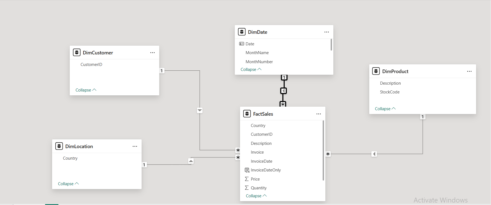

The final Model View screenshot provides evidence that the required Star Schema was implemented in Power BI, including the corrected `DimProduct` table.

---

# 3.16 Why This Model Was Selected

A Star Schema was selected because the Online Retail II dataset is fundamentally a transaction-based dataset.

`FactSales` contains the measurable business events, while the dimensions describe the context in which those events occurred.

This structure provides several advantages:

* Reduces unnecessary duplication
* Separates transactions from descriptive attributes
* Supports efficient filtering
* Supports DAX calculations
* Makes relationships easier to understand
* Supports scalable dashboard development
* Reduces the risk of ambiguous filter paths

The model therefore provides a more appropriate analytical structure than keeping all information in a single flat table.

---

# 3.17 Modelling Challenges

Several modelling considerations were addressed during the creation of the Star Schema.

### CustomerID

Some transactions originally had missing CustomerID values. These were handled during Power Query so that valid transactions could be retained without incorrectly removing them.

### Product Identification

`StockCode` was used as the product identifier because it provides the product-level key required to connect product information to transaction records. The initial `DimProduct` table required recreation after data type validation to ensure the key column held fully distinct values.

### Date Analysis

A dedicated `DimDate` table was required because the project includes monthly and time-based analysis.

### Relationship Design

Relationships were configured as one-to-many wherever the dimension contained unique keys and the fact table contained repeated transaction references.

### Filter Direction

Single-direction filtering was selected to reduce ambiguity and avoid unnecessary bidirectional relationships.

---

# 3.18 Section C Requirement Coverage

| Requirement                                     | Implementation                                        | Evidence                 |
| ------------------------------------------------ | ------------------------------------------------------- | --------------------------- |
| Main fact table identified                      | `FactSales`                                           | FactSales screenshot     |
| Dimension tables created                        | `DimCustomer`, `DimProduct`, `DimDate`, `DimLocation` | Dimension screenshots    |
| Primary/key fields                              | Dimension keys established                            | Model/data-type evidence |
| Appropriate relationships                       | Dimensions connected to FactSales                     | Final Model View         |
| Correct cardinality                             | One-to-many relationships                             | Final Model View         |
| Appropriate cross-filter direction              | Single direction                                      | Final Model View         |
| Dedicated Date Table                            | `DimDate`                                             | DimDate screenshot       |
| Correct Date Table usage                        | Used for time analysis                                | Final model              |
| Appropriate data types                          | Fields validated and typed                            | Data type screenshots    |
| Clear naming                                    | Fact/Dim naming convention                            | Model View               |
| Avoid unnecessary many-to-many                  | One-to-many Star Schema                               | Final Model View         |
| Avoid ambiguous paths                           | Single-direction dimension-to-fact filtering          | Final Model View         |
| Avoid inappropriate bidirectional relationships | Single-direction relationships                        | Final Model View         |
| Data quality correction                         | `DimProduct` recreated after validation               | Recreated screenshot     |

---

# 3.19 Section C Evidence

The modelling evidence is consolidated through the screenshots captured during the modelling process:

* Cleaned dataset loaded
* FactSales created
* DimCustomer created
* DimProduct created
* DimLocation created
* DimDate created
* Data types validated
* DimProduct recreated
* Completed Star Schema

The final Model View screenshots provide the overall evidence that the tables, keys and relationships were implemented in Power BI.


# 3.20 Section C Completion Status

**Section C — Data Modelling: COMPLETED**

The cleaned transaction dataset has been transformed into a structured Star Schema consisting of:

**FactSales**

with the supporting dimensions:

**DimCustomer · DimProduct · DimDate · DimLocation**

The model is now ready for the next stage:

**Section D — DAX Measures & Calculations.**

---

# Appendix — Screenshot Evidence Log (Chronological)

