# ***DSA 3050A - Business Intelligence & Data Visualization***
## ***End Semester Practical Examination***

### **Online Retail II Sales Performance Analysis in Power BI**

**Student:** Snit Teshome

**Student ID:** 670552

**Software:** Microsoft Power BI Desktop

**Dataset:** Online Retail II


## Project Introduction

This project develops a Business Intelligence solution using Microsoft Power BI to analyze online retail sales performance, product performance, customer behaviour, geographic distribution, and cancellation activity. The project follows the complete BI workflow, from data acquisition and preparation to data modelling, DAX analysis, interactive dashboard development, and business interpretation.

The analysis uses a six month subset of the Online Retail II dataset, containing **209,875 transaction line records** from a UK based non store online retailer. The dataset provides information about invoice identification, product identification, product description, quantity purchased, transaction date and time, unit price, customer identification, and customer country, covering the period from **4 January 2010 to 29 June 2010**.

The main objective of the project is to transform the raw transaction level data into meaningful business intelligence that can help management understand sales performance, product and customer contribution, geographic distribution of demand, and factors associated with cancellation activity and missing customer information.

---

# SECTION A: DATASET SELECTION & UNDERSTANDING

## 1. The Source of the Dataset

The dataset used in this project is the **Online Retail II** dataset from the **UCI Machine Learning Repository**.

**Source:** UCI Machine Learning Repository

**Dataset:** Online Retail II

**Original dataset size:** approximately 1,067,371 transaction records

**Original period:** December 2009 to December 2011

**Available at:** https://archive.ics.uci.edu/dataset/502/online%2Bretail%2Bii

The original dataset contains transaction level records from a UK based, registered, non store online retailer. It provides information about invoices, products, quantities, transaction dates, prices, customers, and countries.


*Figure 1: Initial loading of the Online Retail II dataset into Power BI Desktop.*

---

## 2. What the Dataset Represents

The Online Retail II dataset contains transaction level information from an online retail business.

Each row represents an individual **product transaction line** associated with an invoice. Therefore, one invoice can contain multiple rows when a customer purchases multiple products in a single order.

The dataset contains information about transaction and invoice identification, **product identification, product description, quantity purchased, transaction date and time, unit price, customer identification, and customer country.**

This structure makes the dataset appropriate for business intelligence analysis, because sales performance can be examined across multiple dimensions, including **time, product, customer, and country**.

---

## 3. Why This Dataset Was Selected

The Online Retail II dataset was selected because it satisfies the main dataset requirements for the DSA3050A practical examination.

The original dataset contains more than one million records, which is considerably larger than necessary for a 72 hour practical examination. A continuous `**six month analytical window**` was therefore selected from the original dataset, covering `**4 January 2010 to 29 June 2010**.`


Using a six month scope makes the project manageable within the examination window while still retaining enough records and business complexity to support meaningful analysis.

### Dataset Size and Scope

| Attribute | Value |
|---|---:|
| Records | 209,875 |
| Variables | 8 |
| Start Date | 4 January 2010 |
| End Date | 29 June 2010 |
| Distinct Invoice Values | 12,349 |
| Distinct Stock Codes | 4,034 |
| Distinct Product Descriptions | 3,744 |
| Distinct Customer IDs | 2,815 |
| Countries | 32 |


*Figure 2: InvoiceDate profiled to verify the six month analytical period.*

---

## 4. The Main Variables Available

| Variable | Data Type | Description | Analytical Role |
|---|---|---|---|
| `Invoice` | Text | Identifies the transaction or invoice | Transaction identifier |
| `StockCode` | Text | Identifies the product | Product identifier |
| `Description` | Text | Describes the product | Product attribute |
| `Quantity` | Numerical | Number of units involved in the transaction | Sales quantity |
| `InvoiceDate` | Date and Time | Date and time of the transaction | Time dimension |
| `Price` | Numerical | Unit price associated with the transaction | Revenue calculation |
| `CustomerID` | Identifier | Identifies the customer | Customer dimension |
| `Country` | Categorical | Country associated with the customer | Geographic dimension |

The main **numerical variables** are `Quantity` and `Price`. Together these support the calculation of sales related KPIs, since *Sales Amount is calculated as Quantity multiplied by Price*.

The main **categorical variables** are `Description` and `Country`. `StockCode` and `Invoice` function primarily as identifiers rather than descriptive categorical variables.

`InvoiceDate` provides transaction date and time information and supports analysis of daily sales, monthly sales, sales trends, and month over month performance.

The main **identifier variables** are `Invoice`, `StockCode`, and `CustomerID`. These identifiers later support the data model and the relationships between the fact table and the dimension tables described in Section C.


## 5.The Business and Analytical Problem to Be Investigated

The central business problem investigated in this project is:

> **How can retail management better understand sales performance across time, products, customers, and countries, in order to identify important patterns and areas requiring management attention?**

The analysis focuses on which products generate the most revenue, which customers contribute most to revenue, which countries generate the highest sales, how revenue changes over time, which products have high or low sales volumes, how average order value changes, and whether cancellations or unusual transactions are affecting reported performance.

---
## 6.Analytical Questions

The Power BI solution aims to answer the following questions:

1. **How does revenue change over the six month period?** 

2. **Which products generate the highest revenue?** 

3. **Which products have the highest sales volume?** 

4. **Which countries contribute the most revenue?** 

5. **Which customers generate the highest revenue?** 

6. **How does average order value change over time?** 

7. **What transaction patterns or unusual records require attention?** This investigates cancellations, negative quantities, zero prices, missing customer information, and other data quality patterns identified during profiling.


## *Transition to Data Preparation*

Having established the dataset, its characteristics, and the key analytical questions, the next stage is to begin the Business Intelligence development process. The raw dataset was loaded into Microsoft Power BI Desktop, where its structure and data quality were examined before applying the cleaning and transformation steps documented in Section B.


## Initial Data Quality Observations

Before applying any transformations, the dataset was profiled in Power Query using Column Quality, Column Distribution, and Column Profile, evaluated against the *entire dataset* rather than only the default preview rows.


*Figure 3: The dataset opened in Power Query before any transformations were applied.*


*Figure 4: Column Quality, Column Distribution, and Column Profile enabled to assess the dataset before cleaning.*

**1. Missing CustomerID.** Approximately 20 percent of CustomerID values were empty. This does not automatically mean the corresponding transactions are invalid, so these records were not removed without further investigation.

**2.Missing Description.** The Description column contained a small number of missing values, representing less than 1 percent of records. These were investigated during Power Query rather than deleted automatically.

**3.Negative Quantity.** Negative quantity values were present. These may represent cancellations, returns, or reversed transactions, and therefore required investigation before any removal decision.

**4.Cancellation Transactions.** Some invoice values begin with the letter `C`, for example `C493411`, indicating a potential cancellation pattern requiring investigation.

**5.Zero Price Values.** Profiling identified **2,051 records** with a Price value of zero, requiring investigation to determine whether they represent legitimate business cases or invalid records.

**6.Negative Price Values.** The Price field contained negative values, including one unusually large negative amount, requiring examination before any transformation was applied.

**7.Test Product Record.** A record with StockCode equal to `TEST001` and description *"This is a test product"* was identified, requiring investigation to confirm whether it represents genuine business activity.

# SECTION B: POWER QUERY, DATA CLEANING AND TRANSFORMATION

Power Query was used to transform the raw six month dataset into a form suitable for modelling and analysis. Nine significant transformations were applied, each based on a data quality issue identified during the initial profiling in Section A rather than performed to inflate the number of steps.

## 1. Correcting Data Types

**Problem:** The raw fields were imported with uncertain or default data types. Identifiers, text, numerical values, and date and time information all required explicit typing before filtering, calculations, and modelling could be trusted.

**Transformation:** Power Query was used to explicitly assign appropriate types: `Invoice`, `StockCode`, `Description`, and `CustomerID` were set to Text; `Quantity` was set to Whole Number; `InvoiceDate` was set to Date and Time; `Price` was set to Decimal Number; `Country` was set to Text.

**Reason:** Correct data types are required for reliable filtering, comparison, aggregation, and later DAX calculation. `InvoiceDate` in particular must be recognized as a date and time field for time based analysis, and `Quantity` and `Price` must be numeric for sales calculations.

**Result:** All eight original variables were assigned appropriate analytical data types.


*Figure 5: Data type schema confirmed for all fields in the fact table.*

---

## 2. Removing the Test Record

**Problem:** A record with `StockCode` equal to `TEST001` and the description *"This is a test product"* was identified during profiling. Investigation confirmed seven transaction lines carried this test code, sharing an identical description and quantity pattern inconsistent with genuine retail activity.

**Transformation:** The record was filtered out using `Table.SelectRows` on the condition `[StockCode] <> "TEST001"`.

**Reason:** A test transaction does not represent genuine business activity. Retaining it would distort product counts, transaction counts, and other analytical results derived from `StockCode`.

**Result:** All seven test records were removed while the remaining valid transactions were retained.


*Figure 6: Test records isolated before removal, and confirmed absent afterward.*

---

## 3. Cleaning and Standardizing CustomerID

**Problem:** Approximately 20 percent of `CustomerID` values were missing. Among the values that were present, some numeric identifiers carried unnecessary trailing decimal formatting such as `.0`, and some contained leading or trailing whitespace.

**Transformation:** The `CustomerID` field was transformed using `Table.TransformColumns` so that missing or blank values were replaced with the label `Unknown`, values ending in `.0` had that suffix removed, and all remaining values were trimmed of whitespace, with the column retyped as text.

**Reason:** A missing `CustomerID` does not mean the associated sale is invalid. Deleting these transactions would remove genuine revenue from the analysis. Representing missing identifiers explicitly as `Unknown` keeps the transaction in the dataset while making the gap in customer identification visible and analyzable, rather than silently discarding it.

**Result:** `CustomerID` was standardized across the dataset while every transaction with missing customer information was retained rather than deleted.


*Figure 7: CustomerID investigated, then standardized so missing values read as Unknown.*

---

## 4. Investigating and Handling Zero Price Transactions

**Problem:** Profiling identified **2,051 records** with a `Price` value of zero. A zero price could represent a legitimate promotional or adjustment transaction, or it could indicate an invalid record, so this required investigation rather than an assumption in either direction.

**Transformation:** Zero price records were isolated using `Table.SelectRows` on `[Price] = 0` and examined separately from cancellation transactions. Records confirmed as invalid, largely lacking a meaningful product description or transaction context, were removed using the complementary filter `[Price] <> 0`.

**Reason:** Revenue is calculated as Quantity multiplied by Price, so unexplained zero price records would contribute zero revenue while still inflating transaction and quantity counts, distorting product and revenue performance analysis.

**Result:** The invalid zero price records identified during investigation were removed from the analytical dataset.


*Figure 8: Zero price records isolated for investigation, then removed from the cleaned dataset.*

---

## 5. Investigating Negative Quantities

**Problem:** The `Quantity` field contained negative values. A negative quantity could not automatically be assumed to be an error, since retail datasets commonly record returns or cancellations as negative line items.

**Transformation:** All negative quantity records were isolated, totaling **5,737 records**. Each record's invoice number was then examined to determine whether it belonged to a cancellation invoice, identified by an `Invoice` value beginning with the letter `C`.

**Reason:** Automatically deleting every negative quantity would risk removing legitimate cancellation activity. Classifying the records first made it possible to distinguish genuine business events from invalid data.

**Result:** Of the 5,737 negative quantity records, **4,394 records (76.59 percent)** belonged to confirmed cancellation invoices, and **1,343 records (23.41 percent)** did not. This classification was carried forward into Transformation 7.


*Figure 9: Negative quantity records classified into cancellation and non cancellation groups.*

---

## 6. Identifying and Validating Cancellation Invoices

**Problem:** Invoice numbers beginning with the letter `C`, for example `C493411`, indicated a cancellation pattern that had not yet been formally confirmed against quantity and price behaviour.

**Transformation:** Invoices beginning with `C` were isolated using `Text.StartsWith` on the trimmed `Invoice` field, then cross checked against `Quantity` and `Price` to confirm that cancellation invoices consistently carried negative quantities with positive prices.

**Reason:** Cancellation transactions are meaningful business events rather than invalid records. The project's analytical questions specifically require cancellation activity to be measurable, so these records needed to be confirmed and preserved rather than discarded.

**Result:** All **4,394 cancellation records** were validated as carrying negative quantity and positive price, and were retained as part of the analytical transaction history.


*Figure 10: Cancellation invoices isolated, validated, and confirmed as consistent business events.*

---

## 7. Removing Non Cancellation Negative Quantities

**Problem:** Of the 5,737 negative quantity records identified in Transformation 5, **1,343 records** did not belong to a confirmed cancellation invoice and could not be explained as legitimate returns.

**Transformation:** The dataset was filtered to retain records with non negative quantity together with confirmed cancellation invoices, removing negative quantity records that were not part of a cancellation invoice.

**Reason:** This approach preserves the 4,394 legitimate cancellation records while preventing the 1,343 unexplained negative quantity records from distorting quantity and revenue totals elsewhere in the dataset.

**Result:** The 1,343 non cancellation negative quantity records were removed. The dataset stood at **208,525 records** immediately following this step.


*Figure 11: Non cancellation negative quantity records removed while cancellation records were retained.*

---

## 8. Investigating and Handling Negative Prices

**Problem:** The `Price` field contained negative values. Investigation isolated exactly **one record**: Invoice `A506401`, StockCode `B`, description *"Adjust bad debt"*, with a Price of **-53,594.36**.

**Transformation:** The negative price record was identified using `each [Price] < 0` and removed using the complementary filter `each [Price] >= 0`.

**Reason:** This record is a manual accounting adjustment rather than a product sale. Its magnitude is large enough that retaining it would materially distort total revenue and average transaction value, and its structure, a single line item with no matching product description, does not represent a normal transaction.

**Result:** The single invalid negative price record was removed from the cleaned analytical dataset.


*Figure 12: The single negative price record identified as a bad debt adjustment, then removed.*

---

## 9. Removing Duplicate Records

**Problem:** Investigation using `Table.Group` identified **2,359 duplicate groups**, representing **2,499 extra duplicate rows** beyond the first occurrence of each transaction line.

**Transformation:** `Table.Distinct` was applied to the cleaned dataset to remove the confirmed duplicate rows while preserving one instance of each distinct transaction.

**Reason:** Each valid transaction line should contribute once to revenue, quantity, and transaction totals. The 2,499 duplicate rows would otherwise double count these figures across product, customer, and country level analysis.

**Result:** The 2,499 duplicate rows were removed, leaving only distinct legitimate transaction records in the dataset.


*Figure 13: Duplicate groups quantified, then collapsed to distinct records using Table.Distinct.*

---

## Final Data Quality Validation

After the nine transformations above, the cleaned transaction table was checked against a final validation filter confirming that `Invoice`, `StockCode`, and `InvoiceDate` contained no null values, and that `Price` was non negative across every remaining record.


*Figure 14: Final validation filter applied, confirming the dataset is ready for the Data Modelling stage.*

## Power Query Transformation Summary

| # | Problem | Transformation | Reason | Result |
|---|---|---|---|---|
| 1 | Uncertain data types | Corrected all field types | Ensure reliable filtering, calculation, and modelling | Consistent data types across all fields |
| 2 | Test record present | Removed StockCode TEST001 | Prevent test data from affecting analysis | Seven test records removed |
| 3 | Missing or inconsistent CustomerID | Standardized CustomerID, labelled missing as Unknown | Preserve valid transactions while flagging missing identity | CustomerID standardized |
| 4 | Zero price records present | Investigated and removed invalid zero price records | Protect revenue calculations | 2,051 zero price records investigated, invalid records removed |
| 5 | Negative quantities present | Investigated and classified negative quantities | Distinguish cancellations from invalid negatives | 5,737 records classified: 4,394 cancellation, 1,343 non cancellation |
| 6 | Cancellation invoices unconfirmed | Isolated and validated invoices beginning with C | Preserve meaningful cancellation activity | 4,394 cancellation records validated and retained |
| 7 | Non cancellation negative quantities present | Removed 1,343 non cancellation negatives | Prevent invalid quantities distorting totals | Dataset reduced to 208,525 records |
| 8 | Negative price record present | Investigated and removed the invalid negative price record | Prevent a large distortion in revenue figures | One bad debt adjustment record removed |
| 9 | Duplicate records present | Removed 2,499 confirmed duplicate rows | Prevent double counting | Duplicate rows removed, distinct transactions retained |

## *Transition to Data Modelling*

The Power Query stage transformed the raw six month dataset into a cleaner, analysis ready structure by addressing nine distinct data quality issues, each investigated before any record was removed. With the data prepared, the next stage is data modelling, where the cleaned data is organized into a Star Schema, relationships are established between the fact table and its dimensions, and a dedicated Date table is created to support the time based analysis required by the project's analytical questions.

---

# SECTION C: DATA MODELLING

The cleaned transaction dataset was transformed into a Star Schema rather than kept as a single flat table. `FactSales` contains the transactional business events at the centre of the model, while `DimCustomer`, `DimProduct`, `DimDate`, and `DimLocation` provide the descriptive attributes used to filter and analyze those events. One to many relationships were established between each dimension and the fact table.

## 1. Identification of the Main Fact Table

**Problem:** The cleaned dataset consisted of individual transaction line records containing `Quantity`, `Price`, `Invoice`, `InvoiceDate`, `StockCode`, `CustomerID`, and `Country`, but had not yet been formally established as the analytical fact table.

**Transformation:** The cleaned transaction table was renamed to `FactSales`.

**Result:** The cleaned transaction data was established as the central fact table of the Star Schema.

#### *Why FactSales Was Selected*

`FactSales` was selected as the central fact table because each row represents an individual, measurable business event: one product line within one transaction. It contains the quantitative measures `Quantity` and `Price`, together with the foreign keys required to connect each transaction line to its customer, product, date, and location context. This makes `FactSales` the table from which every business performance indicator in the project is ultimately calculated.


*Figure 15: The cleaned transaction table renamed and established as FactSales.*

---

## 2. Creation of Dimension Tables

A Star Schema was developed around `FactSales`. Four dimensions were created based on the analytical requirements of the project.

### DimCustomer

`DimCustomer` contains the unique customer identifiers present in the dataset.

**Key:** `CustomerID`

#### *Why DimCustomer Was Created*

`CustomerID` repeats across many transaction lines in `FactSales`, since the same customer can place multiple orders. Separating customer information into its own dimension avoids repeating this attribute throughout the fact table and supports customer level analysis, including revenue by customer, customer ranking, and the comparison between identified and unknown customer sales used on the Diagnostic Insights dashboard page.


*Figure 16: DimCustomer created with CustomerID as its key.*

---

### DimProduct

`DimProduct` contains the unique product records, identified by `StockCode` with `Description` as an associated attribute.

**Key:** `StockCode`

#### *Why DimProduct Was Created*

`StockCode` and `Description` repeat across every transaction line involving the same product. Separating product information into its own dimension supports revenue by product, quantity sold by product, and the product ranking used by the `Product Sales Rank` measure.

**Revision note.** During the data type validation stage, an issue was identified with the initial `DimProduct` table: `StockCode` did not hold a fully distinct set of product keys, which would have compromised the one to many relationship against `FactSales`. `DimProduct` was recreated to correct this before the model was finalized. The recreation is timestamped after the data type validation screenshots below, confirming it was a corrective step rather than part of the original build sequence.


*Figure 17: DimProduct as originally created, and again after correction.*

---

### DimDate

A dedicated `DimDate` table was created because the dataset contains extensive date and time information and the project requires monthly and time based analysis.

**Key:** Date

#### *Why DimDate Was Created*

`InvoiceDate` alone provides a raw timestamp but not a structured calendar attribute set. A dedicated Date table provides consistent year, month, and date attributes that can be used to filter and aggregate `FactSales` by calendar period, and it supports the monthly trend visuals used throughout the dashboard.


*Figure 18: DimDate created as the model's dedicated calendar dimension.*

---

### DimLocation

`DimLocation` contains the unique country values associated with transactions.

**Key:** Country

#### *Why DimLocation Was Created*

`Country` repeats across many transaction records. Separating location information into its own dimension supports geographic revenue analysis and the country level slicer and charts used on every dashboard page.


*Figure 19: DimLocation created as the model's geographic dimension.*

---

## 3. Primary and Foreign Keys

| Dimension | Key | Fact Table Field |
|---|---|---|
| `DimCustomer` | `CustomerID` | `FactSales[CustomerID]` |
| `DimProduct` | `StockCode` | `FactSales[StockCode]` |
| `DimDate` | Date | `FactSales[InvoiceDate]` |
| `DimLocation` | Country | `FactSales[Country]` |

Each dimension table contains unique values for its key. The corresponding fields in `FactSales` act as foreign keys, allowing each dimension to filter the transaction table without introducing many to many relationships.

## 4. Table Relationships

```text
                    DimDate
                       |
                       |
DimCustomer ---- FactSales ---- DimProduct
                       |
                       |
                  DimLocation
```

## 5. Relationship Cardinality

**DimCustomer to FactSales.** One to many. `DimCustomer` contains one record per customer, while a customer can appear on many transaction lines in `FactSales`. Therefore, DimCustomer (1) to FactSales (many).

**DimProduct to FactSales.** One to many. `DimProduct` contains one record per product, while a product can appear on many transaction lines. Therefore, DimProduct (1) to FactSales (many).

**DimDate to FactSales.** One to many. `DimDate` contains one record per date, while many transactions can occur on the same date. Therefore, DimDate (1) to FactSales (many).

**DimLocation to FactSales.** One to many. `DimLocation` contains one record per country, while many transaction records can belong to the same country. Therefore, DimLocation (1) to FactSales (many).

Each relationship follows the standard Star Schema pattern of one dimension record relating to many fact records, avoiding unnecessary many to many joins.

## 6. Cross Filter Direction

All relationships use single direction filtering, flowing from each dimension table toward `FactSales`. For example, a country selected in a slicer filters the related transaction records in `FactSales`, but a filter on `FactSales` does not flow back to filter `DimLocation`. Single direction filtering was selected to reduce the possibility of ambiguous filter paths, circular filtering, and unexpected aggregation behaviour that unnecessary bidirectional relationships can introduce.

## 7. Dedicated Date Table Usage

`DimDate` was created specifically to support time based analysis, acting as the central calendar structure for the model. This directly supports the analytical questions defined in Section A, particularly how revenue changes over the six month period and how average order value changes over time. `DimDate` also underpins the monthly trend visuals used across all three dashboard pages.

## 8. Appropriate Data Types

Key modelling fields were validated and assigned appropriate types: `Invoice`, `StockCode`, `CustomerID`, `Description`, and `Country` as Text; `Quantity` as Whole Number; `Price` as Decimal Number; `InvoiceDate` and the `DimDate` key as Date and Time. Correct data types are required for relationships, filtering, aggregation, and DAX calculation to behave predictably.


*Figure 20: Model schema validated across all tables. This validation pass is where the DimProduct key issue described above was identified.*

## 9. Clear Table and Field Naming

The model uses a consistent naming convention: `FactSales`, `DimCustomer`, `DimProduct`, `DimDate`, and `DimLocation`. The `Fact` prefix identifies the transactional table, while the `Dim` prefix identifies each descriptive dimension. This convention makes the role of each table immediately clear when writing DAX measures and building dashboard visuals.

## 10. Modelling Decisions and Challenges

**CustomerID.** Transactions with missing CustomerID were not removed. They were labelled Unknown during Power Query, so that customer level analysis could still distinguish identified from unidentified sales rather than losing the underlying revenue entirely.

**Product identification.** `StockCode` was used as the product key because it uniquely identifies each product, while `Description` is retained as a readable attribute. The initial `DimProduct` table required recreation after data type validation, described in full under DimProduct above.

**Date analysis.** A dedicated `DimDate` table was required because the project includes monthly and time based analysis that a raw timestamp field alone cannot support efficiently.

**Filter direction.** Single direction filtering was selected across all relationships to avoid ambiguity and unnecessary bidirectional paths, consistent with standard Star Schema design.

## Model Structure


*Figure 21: The completed Star Schema, including the corrected DimProduct table.*

The resulting model provides a structured foundation for the DAX calculations, dashboard visuals, and business insights developed in the remaining sections.

## *Transition to DAX*

With the analytical model established, the next stage is to develop DAX measures using the relationships and filter context provided by the Star Schema. These measures feed the KPI cards, trend charts, ranking visuals, and diagnostic tables used across the three dashboard pages.

---

# SECTION D: DAX AND BUSINESS CALCULATIONS

DAX measures were developed on top of the analytical data model to convert the cleaned transaction data into meaningful business indicators. A total of **16 measures** were created in a dedicated `_Measures` table, covering core KPIs, calculated business measures, and advanced analytical calculations. Twelve measures were developed to support the Executive Overview and Detailed Analysis pages; four further measures were added afterward to support cancellation analysis on the Diagnostic Insights page.

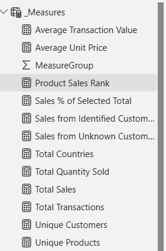

*Figure 22: Measures confirmed in the Measures table. This screenshot predates the four cancellation measures added afterward; a refreshed capture is recommended before final submission.*

## Level 1: Core Measures

**Total Sales**

```DAX
Total Sales =
SUMX(
    FactSales,
    FactSales[Quantity] * FactSales[Price]
)
```

Calculates total sales value by multiplying quantity by unit price for each transaction line and summing the result across the current filter context.

**Total Transactions**

```DAX
Total Transactions =
DISTINCTCOUNT(FactSales[Invoice])
```

Counts the number of distinct invoices in the current filter context, providing the primary measure of transaction volume.

**Total Quantity Sold**

```DAX
Total Quantity Sold =
SUM(FactSales[Quantity])
```

Sums total units sold across the current filter context.

**Unique Products**

```DAX
Unique Products =
DISTINCTCOUNT(FactSales[StockCode])
```

Counts the number of distinct products represented in the current filter context.

**Total Countries**

```DAX
Total Countries =
DISTINCTCOUNT(FactSales[Country])
```

Counts the number of distinct countries represented in the current filter context.

**Average Unit Price**

```DAX
Average Unit Price =
AVERAGE(FactSales[Price])
```

Calculates the average unit price across the current filter context.

**Total Invoices**

```DAX
Total Invoices =
DISTINCTCOUNT(FactSales[Invoice])
```

Counts the total number of distinct invoices across all records, used as the denominator for the Cancellation Rate Percent measure below.

## Level 2: Calculated Business Measures

**Average Transaction Value**

```DAX
Average Transaction Value =
DIVIDE([Total Sales], [Total Transactions], 0)
```

Divides Total Sales by Total Transactions to give the average value generated per order.

**Unique Customers**

```DAX
Unique Customers =
CALCULATE(
    DISTINCTCOUNT(FactSales[CustomerID]),
    FactSales[CustomerID] <> "Unknown"
)
```

Counts distinct identified customers, explicitly excluding records labelled Unknown so that the Unknown placeholder is never counted as a customer.

**Sales from Identified Customers**

```DAX
Sales from Identified Customers =
CALCULATE(
    [Total Sales],
    FactSales[CustomerID] <> "Unknown"
)
```

Restricts Total Sales to transactions where a customer identifier is known.

**Sales from Unknown Customers**

```DAX
Sales from Unknown Customers =
CALCULATE(
    [Total Sales],
    FactSales[CustomerID] = "Unknown"
)
```

Restricts Total Sales to transactions where the customer identifier is missing.

**Cancelled Invoices**

```DAX
Cancelled Invoices =
CALCULATE(
    DISTINCTCOUNT(FactSales[Invoice]),
    LEFT(FactSales[Invoice], 1) = "C"
)
```

Counts distinct invoices beginning with the letter C, identifying confirmed cancellation invoices.

**Cancellation Rate Percent**

```DAX
Cancellation Rate Percent =
DIVIDE([Cancelled Invoices], [Total Invoices], 0)
```

Calculates the proportion of all invoices that were cancelled.

**Total Cancelled Sales**

```DAX
Total Cancelled Sales =
ABS(
    CALCULATE(
        [Total Sales],
        LEFT(FactSales[Invoice], 1) = "C"
    )
)
```

Calculates the absolute sales value associated with cancelled invoices, since cancellation line items carry negative quantity and would otherwise return a negative sales figure.

## Level 3: Advanced DAX

**Sales Percent of Selected Total**

```DAX
Sales Percent of Selected Total =
DIVIDE(
    [Total Sales],
    CALCULATE([Total Sales], ALLSELECTED(FactSales)),
    0
)
```

Calculates the proportion of sales represented by the current selection relative to the selected overall total, demonstrating filter context manipulation with ALLSELECTED.

**Product Sales Rank**

```DAX
Product Sales Rank =
RANKX(
    ALL(FactSales[StockCode]),
    [Total Sales],
    ,
    DESC,
    DENSE
)
```

Ranks each product by total sales, with rank 1 assigned to the highest selling product. ALL removes the individual product filter so that every product's rank reflects its position across the full product set within whatever date, country, and customer filters are already active.

## Summary of DAX Measures

| # | Measure | Level | Main Purpose |
|---|---|---|---|
| 1 | `Total Sales` | Level 1 | Total sales value |
| 2 | `Total Transactions` | Level 1 | Distinct invoice count |
| 3 | `Total Quantity Sold` | Level 1 | Total units sold |
| 4 | `Unique Products` | Level 1 | Distinct product count |
| 5 | `Total Countries` | Level 1 | Distinct country count |
| 6 | `Average Unit Price` | Level 1 | Average price per unit |
| 7 | `Total Invoices` | Level 1 | Distinct invoice count, all records |
| 8 | `Average Transaction Value` | Level 2 | Average sales value per transaction |
| 9 | `Unique Customers` | Level 2 | Distinct identified customers |
| 10 | `Sales from Identified Customers` | Level 2 | Sales tied to known customer IDs |
| 11 | `Sales from Unknown Customers` | Level 2 | Sales tied to missing customer IDs |
| 12 | `Cancelled Invoices` | Level 2 | Distinct cancellation invoice count |
| 13 | `Cancellation Rate Percent` | Level 2 | Proportion of invoices cancelled |
| 14 | `Total Cancelled Sales` | Level 2 | Absolute value of cancelled sales |
| 15 | `Sales Percent of Selected Total` | Level 3 | Share of sales within current selection |
| 16 | `Product Sales Rank` | Level 3 | Ranks products by total sales |

The 16 measures exceed the required minimum of 12 and progress from fundamental aggregations to filter context manipulation and ranking.

## Documentation of the Six Most Important DAX Measures

The following six measures were selected as the most important because together they provide the core performance, transaction, customer, and ranking indicators used throughout the dashboard, while covering the widest range of DAX function categories: iteration with SUMX, counting with DISTINCTCOUNT, safe division with DIVIDE, context filtering with CALCULATE, and advanced ranking with RANKX and ALL.

### Total Sales

**What it calculates:** total sales value using Quantity multiplied by Price for each transaction line, summed across the current filter context.

**Why it is useful:** it is the primary indicator of business performance and the foundation from which the majority of other measures are derived.

**Main DAX function:** SUMX.

**Filter context:** the result changes when the report is filtered by date, country, or product.

**Dashboard use:** used as the primary KPI card on all three pages and as the value field for the trend and product ranking visuals.

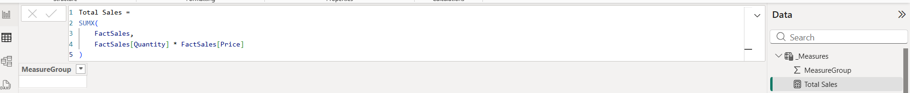

*Figure 23: Total Sales measure defined using SUMX.*

### Total Transactions

**What it calculates:** the count of distinct invoices in the current filter context.

**Why it is useful:** it measures transaction activity and allows revenue to be interpreted alongside transaction volume rather than in isolation.

**Main DAX function:** DISTINCTCOUNT.

**Filter context:** changes with date, country, and product filters.

**Dashboard use:** used as an Executive Overview KPI.

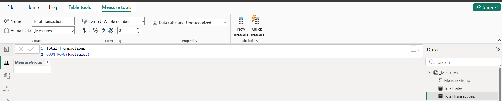

*Figure 24: Total Transactions measure defined using DISTINCTCOUNT.*

### Average Transaction Value

**What it calculates:** Total Sales divided by Total Transactions.

**Why it is useful:** it indicates the average value generated per order and complements the raw sales and transaction counts.

**Main DAX function:** DIVIDE.

**Filter context:** both the numerator and denominator respond to filters, so the average recalculates for any selection.

**Dashboard use:** used as an Executive Overview KPI.

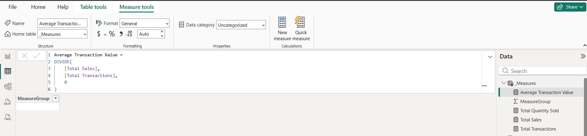

*Figure 25: Average Transaction Value measure defined using DIVIDE.*

### Unique Customers

**What it calculates:** the count of distinct customer identifiers, excluding records labelled Unknown.

**Why it is useful:** it provides a meaningful measure of the identifiable customer base rather than counting the Unknown placeholder as a customer.

**Main DAX functions:** CALCULATE and DISTINCTCOUNT.

**Filter context:** responds to report filters while consistently excluding Unknown regardless of selection.

**Dashboard use:** used as an Executive Overview KPI and referenced in customer analysis on the Detailed Analysis page.

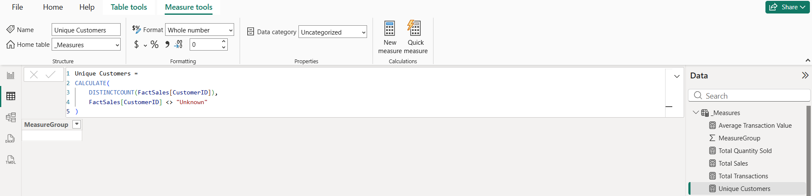

*Figure 26: Unique Customers measure defined using CALCULATE and DISTINCTCOUNT.*

### Sales from Identified Customers

**What it calculates:** total sales restricted to transactions where a customer identifier is known.

**Why it is useful:** it allows direct comparison between sales tied to identified customers and sales where customer information is missing, a data quality issue documented during Power Query.

**Main DAX function:** CALCULATE.

**Filter context:** the identification condition is applied within whatever filter context is already active from the report.

**Dashboard use:** used in the Identified versus Unknown Customer Sales chart on the Detailed Analysis page and as a KPI on the Diagnostic Insights page.

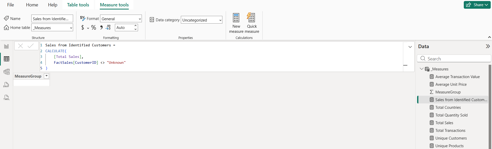

*Figure 27: Sales from Identified Customers measure defined using CALCULATE.*

### Product Sales Rank

**What it calculates:** ranks each product by total sales, with rank 1 assigned to the highest selling product.

**Why it is useful:** it identifies the strongest and weakest performing products and supports the Product Performance matrix.

**Main DAX functions:** RANKX and ALL.

**Filter context:** ALL removes the individual product filter so that each product's rank reflects its position across the full product set within the active date, country, and customer filters, rather than only the currently visible rows.

**Dashboard use:** used in the Product Performance matrix on the Detailed Analysis page and the Diagnostic Product Performance matrix on the Diagnostic Insights page.

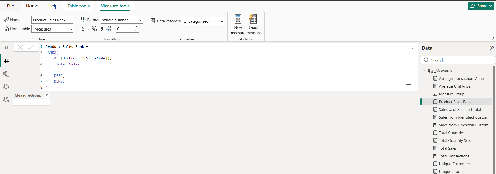

*Figure 28: Product Sales Rank measure defined using RANKX and ALL.*

## DAX and Filter Context

The measures were designed to work with the Star Schema established in Section C. Dimension selections filter `FactSales` through the one to many relationships, allowing the same DAX measure to return different results depending on the user's selections.

```text
DimLocation
   |
FactSales
   |
DAX Measure
```

A measure such as Total Sales therefore does not return a single fixed number. Its result changes according to the active filter context created by slicers, chart axes, and page filters. The use of CALCULATE, ALL, ALLSELECTED, and RANKX across the sixteen measures demonstrates filter context manipulation appropriate to the analytical model.

## *Transition to Data Visualization*

The DAX stage produced sixteen measures covering sales performance, transaction activity, customer identification, and cancellation behaviour. These measures now provide the foundation for the interactive Power BI dashboard developed in Section E.

## Section E: Professional Power BI Dashboards

Three report pages were developed to move the user through the analytical arc required by the assignment: what happened, where it happened, and why it happened together with what requires attention. Each page carries its own subtitle, phrased as the analytical question it answers. A cover page introduces the dataset and lists the three pages before the report content begins.

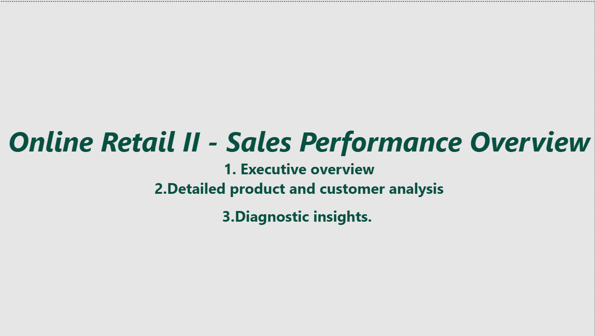

### Page 1: Executive Overview

Subtitle: How did sales perform over the six month period.

This page gives management an immediate view of overall performance. Four KPI cards report Total Sales, Total Transactions, Unique Customers, and Average Transaction Value. A Monthly Sales Trend line chart shows revenue across the six month window, rising sharply in March before settling into a more stable pattern through April to June. A Top 10 Products by Sales Volume bar chart identifies the highest revenue products, led by the white hanging heart tea light holder and the regency cakestand. A Geographic Sales Distribution chart shows that the United Kingdom accounts for the large majority of sales, followed by the Netherlands, EIRE, Germany, and France, with the remaining countries each contributing a comparatively small share.

Slicers for YearMonth, Country, and Product allow the page to be filtered interactively.

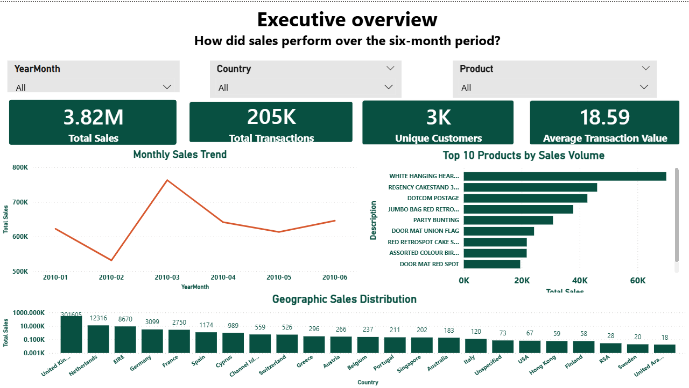

### Page 2: Detailed Product and Customer Analysis

Subtitle: Which products and customers drive the most revenue.

This page moves from the overall summary into product and customer level detail. Three KPI cards report Total Quantity Sold, Unique Products, and Total Countries. An Identified versus Unknown Customer Sales pie chart shows that 86.65 percent of sales are tied to identified customers, while 13.35 percent are associated with the Unknown customer segment created during Power Query cleaning. A Top 10 Products by Quantity Sold bar chart provides a volume based ranking that differs from the revenue based ranking on Page 1, distinguishing high volume low price products from high value low volume products. A customer ranking chart identifies the leading contributors, including the Unknown segment alongside identified customer identifiers. A Product Performance matrix lists StockCode, Total Sales, Total Transactions, Total Quantity Sold, and Product Sales Rank for the full product set, sorted by rank.

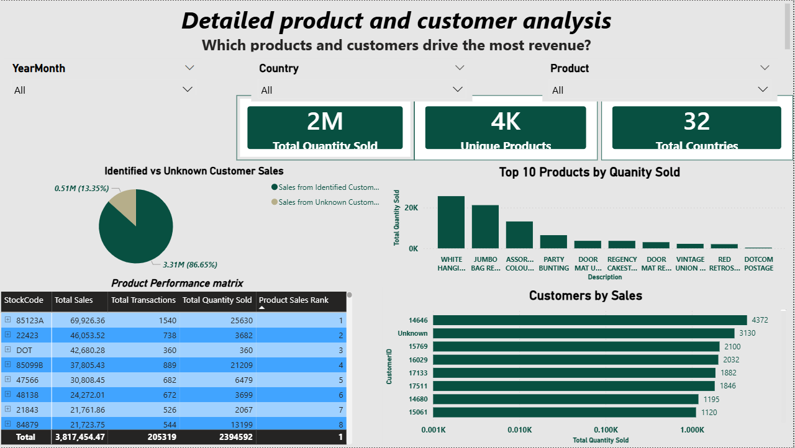

### Page 3: Diagnostic Insights

Subtitle: Why it happened, what needs attention.

This page investigates the factors behind overall performance rather than simply repeating what happened. Four KPI cards report Sales from Identified Customers, Sales from Unknown Customers, Sales Percent of Selected Total, and Cancellation Rate Percent, with the cancellation rate calculated as the proportion of invoices beginning with the letter C. A Cancelled Sales Trend line chart tracks the value of cancelled transactions across the six month period, following a pattern that rises sharply in March before declining and then rising again toward June. A Diagnostic Product Performance matrix extends the Detailed Analysis matrix with Average Transaction Value and Sales Percent of Selected Total for each product. A Geographic Sales Distribution map presents the same country level sales data as a bubble map rather than a bar chart, giving a spatial view of where sales activity concentrates.

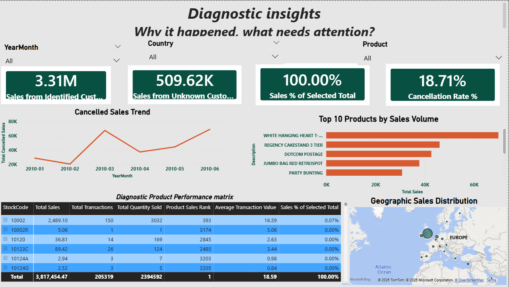
---

## Business Insights

**Insight 1: Missing customer identification represents a measurable share of revenue.**

The Identified versus Unknown Customer Sales chart on Page 2 shows that 13.35 percent of sales value, approximately £0.51 million of the £3.82 million total, is tied to transactions with no customer identifier. Because the `Unique Customers` measure excludes the Unknown segment by design, any customer level analysis, repeat purchase behaviour, customer ranking, targeted marketing, can only be performed reliably on the remaining 86.65 percent. This traces directly to Power Query Transformation 3, where missing CustomerID values were labelled Unknown rather than deleted, so the gap could be measured rather than hidden.

*Recommendation:* Check whether missing CustomerID values cluster around a specific checkout flow or guest checkout option. If so, capturing an identifier at that point could recover a meaningful share of the £0.51 million currently outside customer level analysis.

**Insight 2: Cancellation activity affects a material proportion of invoices.**

The `Cancellation Rate Percent` KPI on Page 3 reports 18.71 percent, roughly one in five invoices, based on the 4,394 validated cancellation invoices from Power Query Transformation 6. The Cancelled Sales Trend chart shows this is not constant: cancellation value rises sharply in March, the same period gross sales peak on Page 1, suggesting cancellation volume scales with order volume rather than holding a flat background rate.

*Recommendation:* Segment `Cancellation Rate Percent` by product and country using the existing slicers to check whether cancellations concentrate in specific items or markets, which would point to a targeted fulfilment issue rather than a general pattern.

**Insight 3: Revenue is heavily concentrated in a small number of products and one country.**

The Top 10 Products charts on Pages 1 and 2 show the white hanging heart tea light holder and regency cakestand leading under both revenue and quantity rankings, confirming genuine top performance rather than a high price on a low volume item. Geographically, the United Kingdom dominates by a wide margin over the other 31 countries combined, indicating the business operates largely as a UK domestic retailer with a long tail of minor international activity.

- *Recommendation:* Prioritize stock availability for the top 10 products, since disruption to any one carries outsized revenue impact. Separately, review `Average Transaction Value by Country` for smaller markets with above-average order value despite low volume, which would flag an under-served market worth deliberate expansion.
---

## Repository Structure

```text
DSA3050-PowerBI-Snit-Teshome-670552/

README.md

data/
    online_retail_ii_6month.xlsx

powerbi/
    DSA3050_SnitTeshome.pbix

screenshots/
    01_raw_data/
        01_loading_preview.png
        02_power_query_raw_state.png
        03_data_quality_baseline_1.png
        03_data_quality_baseline_2.png
        04_date_range.png

    02_power_query/
        01_test_records_before.png
        02_test_records_removed.png
        03_missing_customerid_investigation.png
        04_missing_customerid_before.png
        05_missing_customerid_handled_Query.png
        06_missing_customerid_handled.png
        07_zero_price_removed.png
        08_zero_price_investigation.png
        09_negative_quantity_investigation.png
        10_negative_quantity_summary.png
        11_cancellation_invoice_investigation.png
        12_datatype_investigation.png
        13_cancellation_summary.png
        14_cancellation_validation.png
        15_cancellation_final_results.png
        16_negative_price_investigation.png
        17_removed_negative_price.png
        18_duplicate_investigation.png
        19_removed_duplicates.png
        20_power_query_final_cleaning_validation.png

    03_model/
        01_cleaned_dataset_loaded.png
        02_fact_sales_named.png
        03_dim_customer_created.png
        04_dim_product_created.png
        04_dim_product_created_Recreated.png
        05_dim_Date_created.png
        05_dim_location_created.png
        06_model_data_types.png
        06_model_data_types_1.png
        06_model_data_types_2.png
        06_model_data_types_3.png
        06_model_data_types_4.png
        06_model_data_types_5.png
        07_completed_star_schema.png
        07_completed_star_schema_2.png

    04_dax/
        01_total_sales_dax.png
        02_total_transactions_dax.png
        03_total_quantity_dax.png
        04_average_transaction_value_dax.png
        05_unique_customers_dax.png
        06_unique_products_dax.png
        07_total_countries_dax.png
        08_average_unit_price_dax.png
        09_identified_customer_sales_dax.png
        10_unknown_customer_sales_dax.png
        11_sales_selected_percentage_dax.png
        12_product_sales_rank_dax.png
        13_all_12_measures.png

    05_dashboard_overview/
        01_detailed_analysis..png
        01_diagnostic_insights.png
        01_executive_overview.png
        Cover_Page.png
```

## Data Source Citation

Chen, D. (2019). Online Retail II. UCI Machine Learning Repository. Available at: https://archive.ics.uci.edu/dataset/502/online%2Bretail%2Bii
